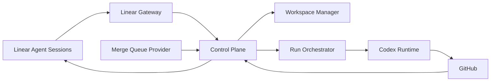

# PatchRelay Architecture Map

PatchRelay is a **Linear-centered orchestration layer** for agentic software delivery.

The architecture follows a simple rule:

- **Linear owns the human conversation**
- **PatchRelay owns deterministic orchestration**
- **Codex owns code generation and repair execution**
- **GitHub owns review and CI truth**
- **A merge queue provider owns final landing**

## System Shape



## Architectural Priorities

1. **Agent legibility over cleverness**
2. **Strict boundary between orchestration and provider integrations**
3. **Persistent issue workspaces**
4. **Repair loops as first-class workflows**
5. **Repository-local guidance as the source of truth**

## Major Domains

### 1. Linear Gateway

Responsible for:

- OAuth installation
- webhook verification
- session event intake
- activity emission
- plan updates
- follow-up elicitation and responses

This is the only domain that should know Linear webhook details directly.

### 2. Control Plane

Responsible for:

- issue lifecycle state
- run scheduling
- retry budgets
- escalation policy
- coordination across review, CI, and queue events

This is the product core.

### 3. Workspace Management

Responsible for:

- worktree allocation
- setup hook execution
- workspace metadata
- cleanup policy

The workspace is durable across the issue lifecycle.

### 4. Codex Runtime

Responsible for:

- implementation runs
- review-fix runs
- CI-fix runs
- queue-repair runs

The runtime should be swappable at the boundary, but the first-class target is Codex App Server.

### 5. GitHub Adapter

Responsible for:

- PR creation and updates
- review state ingestion
- review comment ingestion
- check status and log collection

GitHub is the canonical truth for code review and CI.

### 6. Merge Queue Adapter

Responsible for:

- enqueue and dequeue
- queue status and blockers
- delivery result events
- provider-specific failure reasons

The first provider is Graphite, but the control plane must not depend on Graphite-specific semantics internally.

## Dependency Rules

Use this layering:

- `types`: shared data shapes only
- `policies`: repo-owned workflow and escalation rules
- `adapters`: Linear, GitHub, Graphite, Codex, filesystem, and storage integrations
- `services`: session, workspace, run, repair, and queue orchestration logic
- `runtime`: HTTP handlers, workers, schedulers, and CLI entrypoints

Allowed direction:

- `runtime -> services -> adapters`
- `services -> policies`
- `services -> types`
- `adapters -> types`

Disallowed direction:

- `adapters -> services`
- `adapter -> adapter` coordination without going through a service
- provider-specific branching scattered across runtime handlers

## Lifecycle Summary

```text
Linear delegate event
-> acknowledge session
-> publish plan
-> prepare worktree
-> run Codex
-> open or update PR
-> review loop
-> CI repair loop if needed
-> queue
-> queue repair loop if needed
-> merged or escalated
```

## State Model

Recommended orchestration states:

- `delegated`
- `preparing_workspace`
- `implementing`
- `awaiting_user_input`
- `pr_open`
- `awaiting_review`
- `changes_requested`
- `repairing_ci`
- `awaiting_queue`
- `repairing_queue_failure`
- `merged`
- `failed_terminal`
- `escalated`

## Design Implications

- One owning agent per issue branch keeps coordination manageable.
- The same worktree should be resumed for all iterations of an issue.
- Queue failures are integration problems, not just CI failures.
- The short root docs should point to deeper `docs/` material rather than duplicating it.
- Historical designs are reference material only unless reaffirmed in current docs.

## Read Next

- [PRODUCT_SPEC.md](./PRODUCT_SPEC.md)
- [docs/design-docs/core-beliefs.md](./docs/design-docs/core-beliefs.md)
- [docs/architecture.md](./docs/architecture.md)
- [docs/references/external-patterns.md](./docs/references/external-patterns.md)
