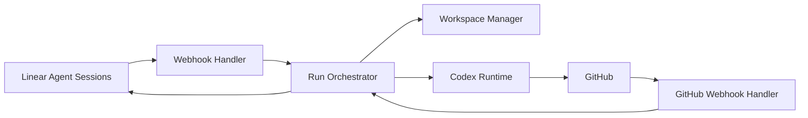

# PatchRelay Architecture Map

PatchRelay is a **Linear-centered orchestration layer** for agentic software delivery.

The architecture follows a simple rule:

- **Linear owns the human conversation**
- **PatchRelay owns deterministic orchestration**
- **Codex owns code generation and repair execution**
- **GitHub owns review and CI truth**
- **A merge queue provider owns final landing**

## System Shape



## Architectural Priorities

1. **Agent legibility over cleverness**
2. **Flat, direct orchestration over layered abstraction**
3. **Persistent issue workspaces**
4. **Repair loops as first-class workflows**
5. **Repository-local guidance as the source of truth**

## Major Domains

### 1. Linear Gateway

Responsible for:

- OAuth installation
- webhook verification
- session event intake
- activity emission
- plan updates
- follow-up elicitation and responses

Implemented in: `webhook-handler.ts`, `webhook-installation-handler.ts`, `linear-client.ts`, `linear-oauth.ts`

### 2. Control Plane

Responsible for:

- issue lifecycle state (factory state machine)
- run scheduling
- retry budgets
- escalation policy
- coordination across review, CI, and queue events

Implemented in: `run-orchestrator.ts`, `factory-state.ts`

### 3. Workspace Management

Responsible for:

- worktree allocation
- setup hook execution
- workspace metadata

The workspace is durable across the issue lifecycle.

Implemented in: `worktree-manager.ts`, `hook-runner.ts`

### 4. Codex Runtime

Responsible for:

- implementation runs
- review-fix runs
- CI-repair runs
- queue-repair runs

The runtime communicates with Codex through `codex app-server` via JSON-RPC.

Implemented in: `codex-app-server.ts`

### 5. GitHub Adapter

Responsible for:

- PR state tracking
- review state ingestion
- check status ingestion
- triggering reactive repair and review-fix runs

Implemented in: `github-webhook-handler.ts`, `github-webhooks.ts`

## Source Layout

The codebase uses a flat module structure rather than a layered directory hierarchy:

- `factory-state.ts` — state machine types and transitions
- `run-orchestrator.ts` — run lifecycle, Codex thread management, reconciliation
- `webhook-handler.ts` — Linear webhook processing, delegation, agent sessions
- `github-webhook-handler.ts` — GitHub webhook processing, reactive run triggers
- `service.ts` — top-level service wiring
- `service-runtime.ts` — async queues, background reconciliation
- `db.ts` — SQLite persistence (issues, runs, webhooks, thread events)
- `http.ts` — Fastify HTTP server and routes

## Lifecycle Summary

```text
Linear delegate event
-> acknowledge session
-> publish plan
-> prepare worktree
-> run Codex (implementation)
-> PR opened (GitHub webhook)
-> review loop (GitHub webhook → review_fix run)
-> CI repair loop if needed (GitHub webhook → ci_repair run)
-> approved and enqueued
-> queue repair loop if needed (GitHub webhook → queue_repair run)
-> merged → done
```

## State Model

Factory states as implemented in `factory-state.ts`:

- `delegated`
- `preparing`
- `implementing`
- `pr_open`
- `awaiting_review`
- `changes_requested`
- `repairing_ci`
- `awaiting_queue`
- `repairing_queue`
- `awaiting_input`
- `escalated`
- `done`
- `failed`

## Design Implications

- One owning agent per issue branch keeps coordination manageable.
- The same worktree should be resumed for all iterations of an issue.
- Queue failures are integration problems, not just CI failures.
- The short root docs should point to deeper `docs/` material rather than duplicating it.
- Historical designs are reference material only unless reaffirmed in current docs.

## Read Next

- [PRODUCT_SPEC.md](./PRODUCT_SPEC.md)
- [docs/design-docs/core-beliefs.md](./docs/design-docs/core-beliefs.md)
- [docs/architecture.md](./docs/architecture.md)
- [docs/references/external-patterns.md](./docs/references/external-patterns.md)
