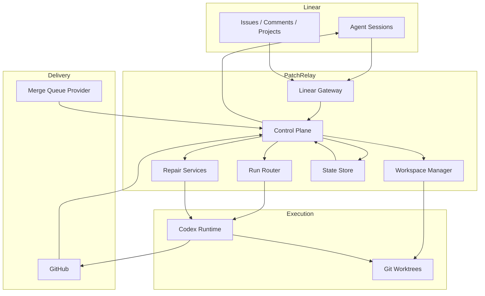

# PatchRelay Detailed Architecture

## Purpose

This document describes the clean-slate target architecture for PatchRelay as a Linear-native agentic software factory.

The service is not a generic prompt runner. It is the deterministic orchestration layer that turns a delegated Linear issue into a reviewed, repairable, merge-queued pull request.

## External Patterns We Are Combining

PatchRelay intentionally combines three patterns:

1. **OpenAI harness engineering**
   - short `AGENTS.md`
   - repo-local docs as system of record
   - worktree-bootable development environments
   - strict architecture boundaries that agents can reason about
2. **Linear official agent demo**
   - app-backed OAuth installation
   - webhook-driven Linear interactions
   - native session activity model
3. **Community long-running agent harness**
   - durable autonomous loop
   - resume-after-failure behavior
   - environment and command safety hooks

What we are **not** copying:

- a comment-only Linear bot
- a single monolithic instruction file
- a polling-only backlog worker
- a one-shot coding session without repair loops

## Component Topology



## Core Responsibilities

### Linear Gateway

Owns:

- webhook verification
- webhook idempotency
- OAuth app installation
- conversion from Linear webhook payloads to internal events
- emission of activities, plans, and external links

The gateway must emit an activity or update external URLs quickly enough to satisfy Linear’s responsiveness expectations.

### Control Plane

Owns:

- issue-to-run ownership
- state transitions
- retry counters
- escalation decisions
- deciding which specialized run to start next

The control plane should know nothing about raw HTTP, GraphQL payload shapes, or provider SDK details beyond typed adapter interfaces.

### Workspace Manager

Owns:

- `git worktree` lifecycle
- worktree path conventions
- per-worktree setup hook execution
- runtime isolation metadata

Recommended path pattern:

- `.trees/<issue-key>/main`

Per-worktree setup should support:

- shared dependency caches
- per-worktree env files
- deterministic port allocation
- optional local observability bootstrapping

### Run Router

Owns dispatching the correct run type:

- `implementation`
- `review_fix`
- `ci_repair`
- `queue_repair`

The run router chooses prompts, input context, retry policy, and expected outputs based on run type.

### Codex Runtime

Owns:

- starting and monitoring Codex execution
- streaming tool and text output for operator visibility
- collecting structured run results

Preferred path:

- Codex App Server

Fallback path:

- Codex CLI wrapper

### Delivery Adapters

GitHub owns:

- PR lifecycle
- reviews
- required checks
- branch protection

Merge Queue Provider owns:

- enqueueing
- queue status
- integration validation
- final landing signal

## Internal Event Model

PatchRelay should normalize all outside inputs into internal events.

### Linear Events

- `linear.session_created`
- `linear.session_prompted`
- `linear.issue_updated`
- `linear.comment_received`

### GitHub Events

- `github.pr_opened`
- `github.review_submitted`
- `github.review_comment_added`
- `github.check_suite_completed`
- `github.check_run_completed`

### Merge Queue Events

- `queue.enqueued`
- `queue.blocked`
- `queue.failed`
- `queue.merged`

### Internal Events

- `run.started`
- `run.completed`
- `run.failed`
- `run.escalated`
- `workspace.ready`

All orchestration should happen from these normalized events.

## Issue Lifecycle

### Main Flow

```text
Delegated in Linear
-> Session acknowledged
-> Plan published
-> Worktree prepared
-> Implementation run
-> PR opened
-> Review loop
-> Approved and checks green
-> Merge queue
-> Merged
```

### Repair Loops

#### Review Loop

Triggered by:

- review comments
- changes requested
- Linear follow-up instructions

Behavior:

- resume same worktree and branch
- update Linear plan if the task meaningfully changed
- push follow-up commit

#### CI Repair Loop

Triggered by:

- required PR checks failing

Behavior:

- gather failing check names and logs
- run a specialized repair prompt
- push fix to same branch
- wait for checks again

#### Queue Repair Loop

Triggered by:

- merge queue failure
- integration rebase failure
- batch validation failure

Behavior:

- treat this as an integration failure, not a normal PR failure
- fetch the latest base branch state
- repair in the same worktree if possible
- return to review if the branch changed materially
- re-enqueue after approval and checks

## Failure Taxonomy

### Repairable Automatically

- formatting or lint failures
- deterministic test failures
- straightforward rebase conflicts
- missing queue metadata or stale enqueue state

### Escalate Quickly

- ambiguous product decisions
- repeated semantic integration failures
- broken credentials or revoked installations
- repository setup hook failures that block all progress

## Provider Interfaces

PatchRelay should expose explicit interfaces for:

### LinearProvider

- install and token management
- session activity emission
- plan updates
- proactive session creation
- issue and comment lookup

### SourceControlProvider

- create/update PR
- list unresolved review comments
- list required checks
- fetch failing logs
- query mergeability and branch protection status

### MergeQueueProvider

- enqueue
- dequeue
- get status
- get blockers
- parse failure reason
- detect successful delivery

### AgentRuntimeProvider

- start run
- stream events
- cancel run
- collect result summary

## State Storage

PatchRelay needs durable state, but only for coordination.

Recommended entities:

- `installations`
- `issues`
- `agent_sessions`
- `workspaces`
- `runs`
- `pull_requests`
- `review_events`
- `check_events`
- `queue_entries`
- `escalations`

Prefer storing authoritative identifiers and decisions, not large duplicated provider payloads.

## Guidance Files And Repo Contracts

The repository should eventually own these contracts:

- `AGENTS.md`
- `ARCHITECTURE.md`
- `PRODUCT_SPEC.md`
- `.factory/setup-worktree.sh`
- `.factory/checks.yaml`
- `.factory/review-policy.yaml`
- `.factory/merge-queue.yaml`

The service should read these contracts rather than hiding workflow logic in prompts.

## Recommended Implementation Order

1. Linear installation, webhook verification, and session response
2. Worktree manager with setup hook support
3. Codex runtime adapter
4. GitHub PR and review adapter
5. Control plane state machine
6. CI repair loop
7. Graphite queue adapter
8. Queue repair loop

## What The Current Repo Should Optimize For

- docs that an agent can navigate quickly
- strong separation between product logic and provider adapters
- minimal historical coupling to the old stage model
- making local execution per worktree cheap and repeatable
- keeping every important decision visible in-repo
