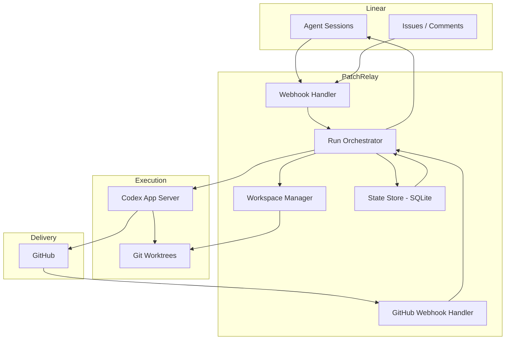

# PatchRelay Detailed Architecture

## Purpose

This document describes the target architecture for PatchRelay as a Linear-native agentic software factory.

The service is not a generic prompt runner. It is the deterministic orchestration layer that turns a delegated Linear issue into a reviewed, repairable, merge-queued pull request.

## External Patterns We Are Combining

PatchRelay intentionally combines three patterns:

1. **OpenAI harness engineering**
   - short `AGENTS.md`
   - repo-local docs as system of record
   - worktree-bootable development environments
   - strict architecture boundaries that agents can reason about
2. **Linear official agent demo**
   - app-backed OAuth installation
   - webhook-driven Linear interactions
   - native session activity model
3. **Community long-running agent harness**
   - durable autonomous loop
   - resume-after-failure behavior
   - environment and command safety hooks

What we are **not** copying:

- a comment-only Linear bot
- a single monolithic instruction file
- a polling-only backlog worker
- a one-shot coding session without repair loops

## Component Topology



## Core Responsibilities

### Webhook Handler (`webhook-handler.ts`)

Owns:

- Linear webhook verification
- webhook idempotency
- OAuth app installation (via `webhook-installation-handler.ts`)
- conversion from Linear webhook payloads to normalized events
- delegation detection and implementation run scheduling
- agent session acknowledgment, plan publishing, and activity emission
- comment and prompt forwarding to active Codex runs

### GitHub Webhook Handler (`github-webhook-handler.ts`)

Owns:

- GitHub webhook signature verification
- PR state tracking (number, URL, review state, check status)
- factory state transitions from GitHub events
- triggering reactive runs (ci_repair, review_fix, queue_repair)
- repair counter management

### Run Orchestrator (`run-orchestrator.ts`)

Owns:

- run lifecycle (create, launch, complete, fail)
- Codex thread and turn management
- worktree preparation and setup hook execution
- prompt construction from issue metadata and workflow files
- retry budget enforcement and escalation
- reconciliation of active runs after restart
- Linear activity and plan updates during runs

### Workspace Manager (`worktree-manager.ts`)

Owns:

- `git worktree` lifecycle
- worktree path conventions
- branch creation and reuse

### Codex Runtime (`codex-app-server.ts`)

Owns:

- starting and monitoring Codex execution via JSON-RPC
- thread start, turn start, turn steering
- notification handling (turn/completed events)

## Issue Lifecycle

### Main Flow

```text
Delegated in Linear
-> Session acknowledged
-> Plan published
-> Worktree prepared
-> Implementation run (Codex)
-> PR opened (detected via GitHub webhook)
-> Review loop
-> Approved and checks green
-> Merge queue
-> Merged → done
```

### Reactive Loops

#### Review Fix Loop

Triggered by:

- GitHub `review_changes_requested` event

Behavior:

- resume same worktree and branch
- start a `review_fix` run with reviewer feedback as context
- Codex addresses the feedback and pushes

#### CI Repair Loop

Triggered by:

- GitHub `check_failed` event

Behavior:

- start a `ci_repair` run in the same worktree
- Codex reads failure logs, fixes the code, pushes
- budget: 2 attempts before escalation

#### Queue Repair Loop

Triggered by:

- GitHub `merge_group_failed` event

Behavior:

- start a `queue_repair` run in the same worktree
- Codex rebases onto latest main, resolves conflicts, pushes
- budget: 2 attempts before escalation

## Factory State Machine

States as defined in `factory-state.ts`:

```text
delegated → preparing → implementing → pr_open → awaiting_review
  → changes_requested → implementing (review fix)
  → repairing_ci → pr_open (CI repair)
  → awaiting_queue → done (merged)
  → repairing_queue → pr_open (queue repair)
  → awaiting_input (agent needs human guidance)
  → escalated (retry budgets exhausted)
  → failed (unrecoverable error)
```

## Failure Taxonomy

### Repairable Automatically

- formatting or lint failures
- deterministic test failures
- straightforward rebase conflicts

### Escalate Quickly

- ambiguous product decisions
- repeated semantic integration failures
- broken credentials or revoked installations
- repository setup hook failures that block all progress

## State Storage

PatchRelay uses SQLite with these tables:

- `issues` — one record per tracked issue, includes factory state, PR state, run pointers, repair counters
- `runs` — one record per Codex run (implementation, review_fix, ci_repair, queue_repair)
- `webhook_events` — deduplication and processing status for Linear webhooks
- `run_thread_events` — per-run transcript of Codex thread events (when extended history is enabled)
- `linear_installations` — OAuth credentials and installation metadata
- `operator_feed` — event log for operator CLI

## Workflow Files

The repository should contain:

- `IMPLEMENTATION_WORKFLOW.md` — guidance for implementation, CI repair, and queue repair runs
- `REVIEW_WORKFLOW.md` — guidance for review fix runs

The run orchestrator reads these files and includes them in the Codex prompt. Keep them short and action-oriented.

## What The Current Repo Should Optimize For

- docs that an agent can navigate quickly
- flat, direct orchestration code over layered abstractions
- making local execution per worktree cheap and repeatable
- keeping every important decision visible in-repo
