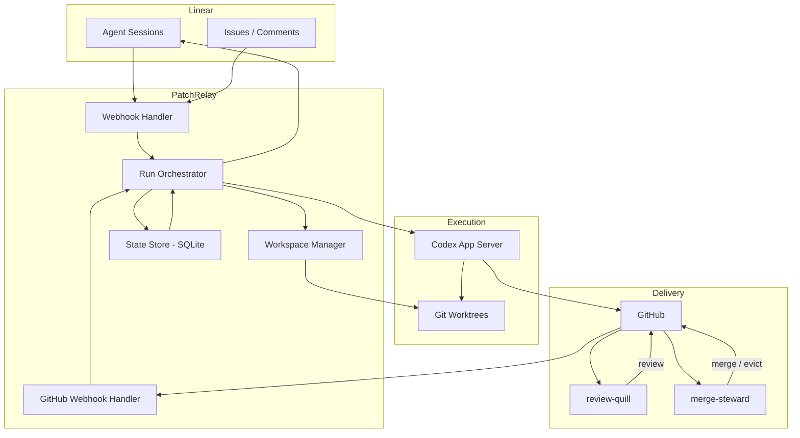
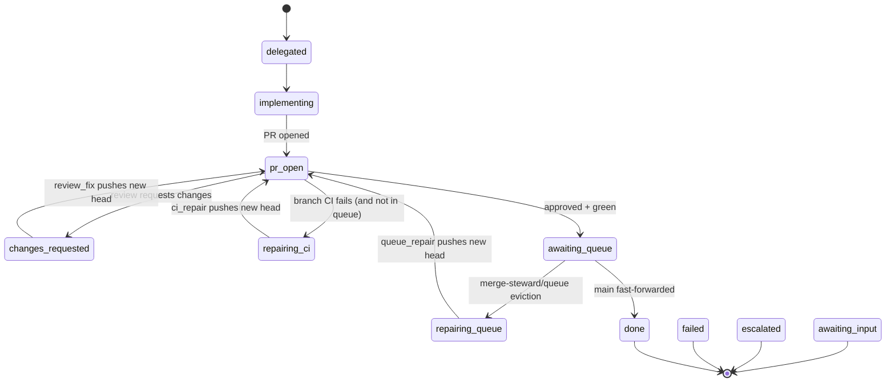

# PatchRelay Architecture

## Scope

This document covers the `patchrelay` harness specifically: what it owns, how it is structured, and how issue lifecycles flow through it. For the stack-level overview (patchrelay + review-quill + merge-steward), see the [README](../README.md) and [merge-queue.md](./merge-queue.md).

The harness is not a generic prompt runner. It is the deterministic orchestration layer that turns a delegated Linear issue into a linked pull request and keeps that PR healthy until merge or close. Review and merge execution live in separate services.

## Architectural priorities

1. **Agent legibility over cleverness** — the system should be easy for an agent to reason about without studying the internals.
2. **Flat, direct orchestration over layered abstraction** — orchestrators, handlers, and service shells stay narrow; extract by responsibility before layering. See [architecture-guardrails.md](./architecture-guardrails.md) for the extraction rules.
3. **Persistent issue workspaces** — one durable worktree per issue lifecycle, resumed across iterations.
4. **Repair loops as first-class workflows** — `implementation`, `review_fix`, `ci_repair`, `queue_repair` have distinct context, entry conditions, and success criteria, not one generic "try again."
5. **Repository-local guidance as the source of truth** — `IMPLEMENTATION_WORKFLOW.md`, `REVIEW_WORKFLOW.md`, and repo-local docs define how the agent should work in that repo.

The decisions behind these priorities are captured in [design-docs/core-beliefs.md](./design-docs/core-beliefs.md).
Telemetry and dashboard activity boundaries are captured in [telemetry.md](./telemetry.md).

## Component topology



## Source layout

The codebase uses focused top-level modules with small subdirectories where a responsibility has grown enough to need internal structure:

- `issue-phase.ts` — presentation-only phase derived from durable facts and current run/task context
- `issue-session-events.ts`, `issue-session-projector.ts`, `issue-session-state.ts` — session event parsing and session read-model projection
- `reactive-workflow-intent.ts` — PR-derived follow-up intent used to create durable workflow signals/tasks
- `workflow-model.ts`, `workflow-observation-context.ts`, `workflow-snapshot.ts`, `workflow-task-derivation.ts`, `workflow-gates.ts` — the durable workflow model: observations plus issue facts become a snapshot, open workflow tasks, and gate decisions
- `workflow-task-reconciler.ts` — materializes open workflow tasks from the current snapshot
- `pending-workflow-task.ts` — helper for asking whether an open runnable workflow task exists
- `run-orchestrator.ts`, `run-launcher.ts`, `run-finalizer.ts`, `run-reconciler.ts` — run lifecycle, Codex thread management, and completion handling
- `webhook-handler.ts` — Linear webhook processing, delegation, agent sessions
- `github-webhook-handler.ts` — GitHub webhook processing, reactive run triggers
- `service.ts` — top-level service wiring
- `service-runtime.ts` — async queues, background reconciliation
- `db.ts`, `db/*` — SQLite persistence stores and migrations
- `http.ts` — Fastify HTTP server and routes

## Core responsibilities

### Webhook Handler (`webhook-handler.ts`)

Owns:

- Linear webhook verification
- webhook idempotency
- OAuth app installation (via `webhook-installation-handler.ts`)
- conversion from Linear webhook payloads to normalized events
- delegation detection and implementation run scheduling
- agent session acknowledgment, plan publishing, and activity emission
- Codex conversation input routing for agent-session prompts and explicitly addressed issue comments
- checkpoint-aware forwarding to active Codex runs
- preserving high-signal session context from Linear webhooks for run startup

### GitHub Webhook Handler (`github-webhook-handler.ts`)

Owns:

- GitHub webhook signature verification
- PR state tracking (number, URL, review state, check status)
- triggering reactive runs on linked delegated PR follow-up events
- repair counter management

### Run Orchestrator (`run-orchestrator.ts`)

Owns:

- run lifecycle (create, launch, complete, fail)
- Codex thread and turn management
- worktree preparation and setup hook execution
- prompt construction from issue metadata and workflow files
- packaging verification evidence for the current run type
- retry budget enforcement and escalation
- reconciliation of active runs after restart
- Linear activity and plan updates during runs
- translating Codex run outcomes into concise Linear-visible state summaries

### Workspace Manager (`worktree-manager.ts`)

Owns:

- `git worktree` lifecycle
- worktree path conventions
- branch creation and reuse

### Codex Runtime (`codex-app-server.ts`)

Owns:

- starting and monitoring Codex execution via JSON-RPC
- thread start, turn start, turn steering
- notification handling (turn/completed events)
- exposing thread, turn, and item state that can be reduced into human-facing status summaries

Prompting is split across two layers:

- durable PatchRelay rules in Codex `developerInstructions`
- a lean per-run prompt with the current objective, constraints, runtime context, workflow pointer, and publish target

This keeps stable harness policy out of every task turn while still letting PatchRelay inject the exact GitHub, Linear, and repair evidence relevant to the current run.

## Ownership

PatchRelay keeps ownership simple:

- workflow truth comes from observations plus current issue facts projected into a workflow snapshot
- runnable PatchRelay work comes only from open `workflow_tasks` with `task_type = 'run'` and `gate_action = 'start'`
- run ownership comes from `runs` plus the active issue slot
- human-facing state comes from projections (`issue_sessions`, tracked issue rows, Linear status), not a second lifecycle model
- automation authority comes from current Linear delegation to PatchRelay

PatchRelay persists one explicit authority bit:

- `delegatedToPatchRelay`

`delegatedToPatchRelay` decides whether PatchRelay may actively write or repair code right now.

Once a PR is linked to an issue, delegation decides whether PatchRelay may actively repair it.
That PR may have been opened by PatchRelay, a human, or another external system.

When an issue is undelegated:

- active PatchRelay runs must stop
- open runnable workflow tasks must stop dispatching
- PatchRelay must stop starting new implementation or repair runs
- PatchRelay must continue ingesting GitHub truth for the issue
- local no-PR work should keep its literal state such as `delegated` or `implementing`
- PR-backed states such as `pr_open`, `changes_requested`, and `awaiting_queue` should remain visible when still true

That observer-only mode is important because downstream services keep operating from PR truth:

- `review-quill` remains PR-centric
- `merge-steward` remains PR-centric

Re-delegation should resume from current truth, not from a generic “start over” state.
If an external PR appears on a different branch, PatchRelay can link it when the webhook carries one unambiguous tracked issue key for the same project.

## Issue lifecycle

### Main flow

```text
Delegated in Linear
-> Session acknowledged
-> Plan published
-> Worktree prepared
-> Implementation run (Codex)
-> PatchRelay opens draft PR
-> PatchRelay marks PR ready when implementation is complete
-> review-quill reviews ready PRs with green CI
-> merge-steward queues ready PRs with green CI and approval
-> If requested changes, red CI, or merge-steward incident lands on a linked delegated PR, PatchRelay resumes the same branch
-> Merged → done
```

### Reactive loops

#### Review fix loop

Triggered by:

- GitHub `review_changes_requested` event

Behavior:

- resume same worktree and branch
- start a `review_fix` run with reviewer feedback as context
- Codex addresses the feedback and pushes

#### CI repair loop

Triggered by:

- GitHub `check_failed` event

Behavior:

- start a `ci_repair` run in the same worktree
- Codex reads failure logs, fixes the code, pushes
- budget: 2 attempts before escalation

This loop must not start while the issue is undelegated, even though GitHub check state should still be recorded.

#### Queue repair loop

Triggered by:

- merge-steward eviction — a `merge-steward/queue` check run with failure status

Behavior:

- PatchRelay detects the check run failure and starts a `queue_repair` run in the same worktree
- Codex reads the steward's failure context, fixes the code, pushes
- PatchRelay returns the issue to queue wait; the steward re-admits after a fresh approved, green head is visible in GitHub
- budget: 2 attempts before escalation

This loop must also respect `delegatedToPatchRelay`. merge-steward may continue reporting queue truth on undelegated PRs, but PatchRelay should only repair when authority is restored.

## Workflow Model

The runtime has one operational path:

```text
external facts / human input
-> workflow_observations + current issue facts
-> WorkflowSnapshot
-> workflow_tasks
-> runs
-> projections
```

`WorkflowSnapshot` contains the authority epoch, current artifacts, active run,
blockers, child workflow counts, and derived context for the next task. Task
derivation decides whether the workflow is waiting, ready to run, asking for
input, verifying, or escalating. The dispatcher and run planner only launch
from open runnable workflow tasks. Session events are inbox/history facts and
diagnostics; they do not dispatch runs by themselves.

## One workflow model

PatchRelay stores external facts, explicit outcomes/input requests, observations,
tasks, and runs. `WorkflowSnapshot` derives the currently open tasks from those
facts. Open runnable rows in `workflow_tasks` are the only executor admission
source. Operator and Linear views derive an `IssuePhase` at the presentation
boundary; the phase is never persisted and never drives execution.



### Mapping to Linear workflow states

PatchRelay maps the derived `IssuePhase` onto the four-state Linear vocabulary the operator already reads. See [concepts.md](./concepts.md#four-states) for the model and the per-state owners.

| Linear state | Derived phases |
|-|-|
| In Progress | `implementing`, `changes_requested`, `repairing_ci`, `repairing_queue` |
| In Review | `pr_open` (review pending or approved-but-CI-not-yet-green) |
| In Deploy | `awaiting_queue` (merge-steward queue entry exists) |
| Done | `done` |
| Cancelled | `failed` (closed-without-merge variant) |

The mapping is rendered from `IssueExecutionState` plus PR facts in `src/linear-workflow-state-sync.ts`. When a project's Linear workflow does not include an In Deploy state, the issue stays in In Review with the configured `queued-for-deploy` sub-label so operators can distinguish "in review, awaiting verdict" from "in review, queued for landing." The label name is configurable via project config; see [github-queue-contract.md](./github-queue-contract.md#configurable-names-per-service).

### Run lifecycle and `superseded` cancellation

`RunStatus` (`src/db-types.ts`) is `queued | running | completed | failed | released | superseded`.

`superseded` is the mid-flight cancellation outcome: a run was cancelled because its premise is no longer true (most commonly, a PR approval landed on the same head SHA the run was working from). The orchestrator releases the active Codex turn's lease, marks the run row `superseded`, and writes a structured summary.

A complementary `shouldNotPublish` flag on the run record makes cancellation hard rather than advisory. Even if the Codex turn races ahead and produces output before the release lands, the run-finalizer reads this flag and refuses to invoke `git push` / `gh pr create` / `gh pr edit`. This is the "no further side effects accepted" contract — soft cancellation alone is not enough because the agent runs in a separate process.

### Codex conversation input

PatchRelay treats the Linear agent session as the chat surface for the delegated agent. A human `agentPrompted` event is ordinary Codex input: if a run is active, PatchRelay delivers it through `turn/steer`; if the issue is idle but still delegated, PatchRelay queues the next run on the existing issue thread. Linear issue comments are different. They are issue discussion by default and become Codex input only when the comment explicitly addresses PatchRelay at the start, for example `PatchRelay, ...` or `@PatchRelay ...`.

Accepted natural-language input is routed through the Codex conversation adapter, not a command parser. The adapter uses the structured follow-up classifier only for narrow control decisions such as status and stop, with facts like source surface, active run type, delegation state, outstanding input, direct-reply status, and PR review state. Explicit protocol fields, such as Linear's agent stop signal, remain deterministic; ordinary operator language must not be routed by keyword-only intent gates.

When a run is active, accepted follow-up input is delivered to the active Codex turn instead of being dropped. The steering prompt carries a checkpoint contract: finish any non-interruptible command, then fold the new instruction into the next decision before the next meaningful side effect when possible. Status questions during an active run are answered as ephemeral `thought` activity so they do not close the agent session; idle status questions can use a normal `response`.

Delivery success or failure is recorded as a non-actionable `prompt_delivered` session event for diagnostics. Failed delivery is also surfaced as operator/feed activity and Linear-visible activity, then the input is recorded as durable inbox work for the next workflow-task reconciliation. Terminal run summaries include the count of delivered and failed steering attempts when any occurred.

If a completed issue with a published PR receives a new accepted prompt, PatchRelay reopens the issue as replacement work. The old PR facts are kept as context, current PR fields are cleared, and the next implementation run is instructed to create a fresh replacement PR rather than mutate or republish the completed one.

### Requested-changes repair context

Requested-changes repair owns its GitHub review context directly. Before a `review_fix` run starts, PatchRelay always refreshes the live PR state and hydrates the task/run context from GitHub with the latest requested-changes review id, review body, inline comments, review commit SHA, current PR head SHA, and reviewer login when available. Existing Linear issue text or agent-session history can add context, but it cannot suppress the GitHub refresh and is not the source of truth for review feedback. If GitHub review context cannot be fetched, the launch context is explicitly marked degraded so the worker re-reads the review before changing code.

Each review-fix run emits a review-round start activity that identifies the round number, reviewer, and captured comment count when known. The final Linear response for the run includes the review round and concise addressed outcome without commit hashes or empty boilerplate sections.

### No-op publish detection

When a run finishes, the finalizer recomputes `patch_id` for the new head and compares it to `IssueRecord.lastPublishedPatchId` (cached on every successful push):

- **Equal** → mark the run `outcome = noop_publish`. Do not advance counters that would trigger downstream reactive runs (don't reset `reviewFixAttempts` to zero; don't dismiss any cached review-quill approval — review-quill's own carry-forward gate handles re-emission).
- **Different** → record the new identity and proceed normally.

Identity computation happens in a per-repo cache directory shared across PRs, separate from per-issue worktrees. On any failure (network, fetch error, missing refs) the helper returns `undefined` rather than throwing; the webhook handler treats `undefined` conservatively and lets the normal reactive cascade run. Failing closed preserves correctness at the cost of occasional missed optimisations.

A complementary prompt rule in `src/prompting/patchrelay.ts` instructs the agent to compute `patch_id` before pushing and finish the run as a no-op if it equals the last published value. The prompt is the first line of defense; the finalizer's post-hoc detection is the backstop for cases where the agent pushes anyway.

### Undelegation semantics

For undelegated issues:

- no PR yet — preserve the literal local-work state and expose a paused waiting reason
- PR exists — preserve the PR facts and expose a paused waiting reason

That keeps operator-facing state truthful without letting PatchRelay continue writing code. `awaiting_input` is reserved for real human-needed states, not generic paused local work.

## Failure taxonomy

### Repairable automatically

- formatting or lint failures
- deterministic test failures
- straightforward integration conflicts

### Escalate quickly

- ambiguous product decisions
- repeated semantic integration failures
- broken credentials or revoked installations
- repository setup hook failures that block all progress

### Failure-source classification

The GitHub fact projector and workflow-task derivation both consult a `failureSource` field on incoming `check_failed` events:

| `failureSource` | Source | Routes to |
|-|-|-|
| `branch_ci` | A required check on the PR head | `repairing_ci` (only when *not* In Deploy) |
| `queue_eviction` | The configured eviction check (`merge-steward/queue`) | `repairing_queue` |

While the issue is **In Deploy** (display state `awaiting_queue`), `branch_ci` failures are metadata only: no `ci_repair` task is launched. The lander owns the integration tree on a different SHA; branch CI on the PR head does not block landing. The only signal that returns the issue to In Progress in this window is the `queue_eviction` source.

Classification happens in GitHub fact derivation (which calls `isQueueEvictionFailure` once and forwards the result) and is enforced again in workflow-task derivation so the display projection and the workflow-task path cannot drift.

## State storage

PatchRelay uses SQLite. Current tables:

- `issues` — one record per tracked issue: external facts, explicit outcome/input facts, run pointers, and repair counters
- `workflow_observations` — append-only workflow facts and inbox signals
- `workflow_tasks` — derived open/closed tasks; open runnable run tasks are the executor admission source
- `issue_sessions` — session/read-model projection: visible state, waiting reason, summaries, and display fields
- `issue_session_events` — session-history/event inbox; runnable work is derived through workflow observations/tasks, not directly from these rows
- `issue_session_leases` — executor lease truth (`lease_id`, `worker_id`, `leased_until`)
- `issue_session_threads` — resumable thread pointer and generation/compaction state
- `runs` — one record per Codex run, including compact latest activity, outcome, and aggregate counts
- `webhook_events` — deduplication and audit log for incoming webhooks (see below)
- `linear_installations` — OAuth credentials and installation metadata
- `operator_feed_events` — event log for the operator CLI

GitHub remains the source of truth for PR readiness, review, and merge state — PatchRelay stores derived state to correlate Linear issues with local workspaces and runs, not to duplicate GitHub.

Codex remains the source of truth for its thread transcript. PatchRelay reads the live thread through the daemon-owned app-server and stores only a bounded operator projection: latest understandable activity/message/plan, aggregate command/file/tool counts, and the final outcome. It does not persist raw Codex notifications, reasoning, command output, or a second transcript in SQLite.

### Recovery doctrine: re-derivation, not replay

There is one recovery mechanism for lost or unprocessed webhooks: **re-derivation
from GitHub/Linear truth via reconciliation**. The idle reconciler polls the
upstream state, builds the same normalized facts a webhook would have carried,
and feeds them through the same `WorkflowSnapshot` and workflow-task derivation
used by webhook handling — so a dropped webhook converges to the same tasks the
delivered webhook would have produced.

`webhook_events` is therefore a **dedupe + forensics log, never a replay
queue**:

- a row exists so duplicate deliveries are dropped and operators can inspect
  what arrived;
- a row stuck at `processing_status = 'pending'` means a crash interrupted
  processing — at startup such rows older than 15 minutes are marked
  `'abandoned'` (counted and surfaced in the operator feed), and the missed
  effect is recovered by reconciliation, not by re-processing the payload;
- every non-`pending` row (`processed`, `failed`, `abandoned`, …) is eligible
  for archiving by the retention pass, so the table cannot leak.

Failure provenance follows the same doctrine: a recorded GitHub failure
(`lastGitHubFailure*`) is only cleared when *newer* evidence supersedes it —
the head advanced, the same check went green on the recorded failure head, or
the PR merged/closed (`mayClearFailureProvenance` in `failure-provenance.ts`).
A poll that merely "looks green" never swallows a pending repair.

## No-PR completion check

Implementation runs now have one lean fallback path when no PR is linked at turn completion:

1. the main run finishes
2. PatchRelay checks whether a PR was published
3. if no PR was observed, PatchRelay forks the thread once for a `completion check`
4. the fork returns one typed outcome:
   - `continue`
   - `needs_input`
   - `done`
   - `failed`

This is the only supported no-PR decision path.

The completion check is intentionally secondary and read-only:

- it runs in a read-only fork
- it must not execute tools or edit the repository
- it exists only to decide the next step after a no-PR outcome

Observability is intentionally split by surface:

- dashboard: `No PR found; checking next step` and the final completion-check result
- Linear: only persistent human-relevant outcomes such as `needs_input`, valid no-PR `done`, or `failed`
- run/session logs: fork thread id, turn id, and typed completion-check result

## Workflow files

The target repository (the one PatchRelay is implementing for) should contain:

- `IMPLEMENTATION_WORKFLOW.md` — guidance for implementation, CI repair, and queue repair runs
- `REVIEW_WORKFLOW.md` — guidance for review fix runs

The run orchestrator points Codex at these files from the lean per-run scaffold rather than inlining them into every turn. Keep them short and action-oriented. See [prompting.md](./prompting.md) for how they compose with `developerInstructions` and the built-in scaffold.

## Design implications

- One owning agent per issue branch keeps coordination manageable.
- Delegation does not automatically imply "this issue must own a branch and PR"; tracker and orchestration issues may complete without opening code.
- The same worktree is resumed for all iterations of an issue — not a fresh clone per run.
- Queue failures are integration problems, not just CI failures — they get their own `queue_repair` loop.
- The repository is part of the harness. If an agent cannot rediscover a rule in-repo, the rule is operationally weak. Keep root docs navigational and treat deeper `docs/` material as the durable system of record.
- Historical designs are reference material only unless reaffirmed in current docs.
- Preserve compact verification evidence (failing check names, review comments, queue incidents) rather than replaying ever-growing transcripts.
- Linear communication stays high-signal: immediate acknowledgment, concise in-flight activity, lifecycle-aware plans, quiet-period heartbeats, and exactly one terminal response/error per meaningful outcome; deeper status lives behind session links, not in transcript dumps.
