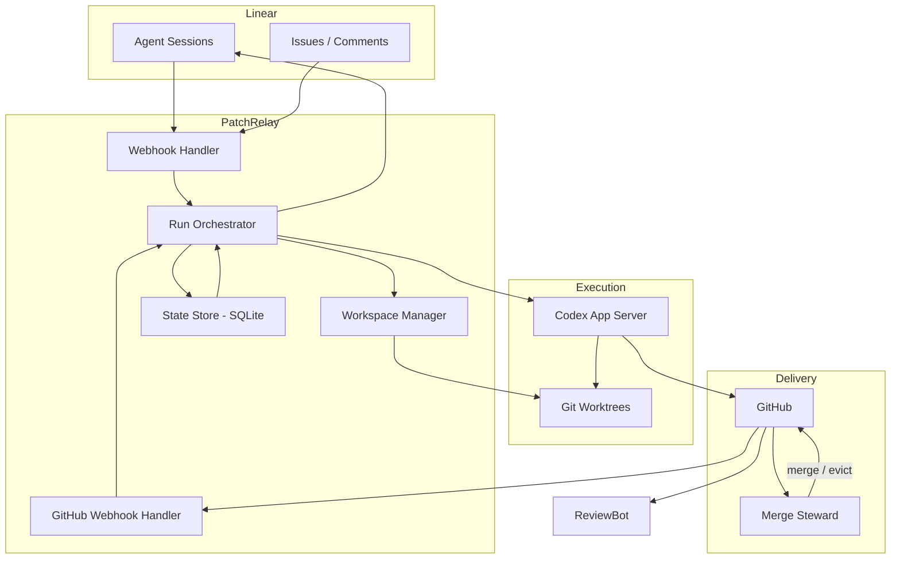

# PatchRelay Detailed Architecture

## Purpose

This document describes the target architecture for PatchRelay as a Linear-native agentic software factory.

The service is not a generic prompt runner. It is the deterministic orchestration layer that turns a delegated Linear issue into a linked pull request and keeps that PR healthy until merge or close. Separate downstream services own review automation and merge execution.

## External Patterns We Are Combining

PatchRelay intentionally combines three patterns:

1. **OpenAI harness engineering**
   - short `AGENTS.md`
   - repo-local docs as system of record
   - progressive disclosure through linked docs
   - worktree-bootable development environments
   - agent-legible validation signals
   - strict architecture boundaries that agents can reason about
   - recurring garbage collection for drift
2. **Linear official agent demo**
   - app-backed OAuth installation
   - webhook-driven Linear interactions
   - native session activity model
3. **Community long-running agent harness**
   - durable autonomous loop
   - resume-after-failure behavior
   - environment and command safety hooks

What we are **not** copying:

- a comment-only Linear bot
- a single monolithic instruction file
- a polling-only backlog worker
- a one-shot coding session without repair loops

## Component Topology



## Core Responsibilities

### Webhook Handler (`webhook-handler.ts`)

Owns:

- Linear webhook verification
- webhook idempotency
- OAuth app installation (via `webhook-installation-handler.ts`)
- conversion from Linear webhook payloads to normalized events
- delegation detection and implementation run scheduling
- agent session acknowledgment, plan publishing, and activity emission
- comment and prompt forwarding to active Codex runs
- preserving high-signal session context from Linear webhooks for run startup

### GitHub Webhook Handler (`github-webhook-handler.ts`)

Owns:

- GitHub webhook signature verification
- PR state tracking (number, URL, review state, check status)
- triggering reactive runs on linked delegated PR follow-up events
- repair counter management

### Run Orchestrator (`run-orchestrator.ts`)

Owns:

- run lifecycle (create, launch, complete, fail)
- Codex thread and turn management
- worktree preparation and setup hook execution
- prompt construction from issue metadata and workflow files
- packaging verification evidence for the current run type
- retry budget enforcement and escalation
- reconciliation of active runs after restart
- Linear activity and plan updates during runs
- translating Codex run outcomes into concise Linear-visible state summaries

### Workspace Manager (`worktree-manager.ts`)

Owns:

- `git worktree` lifecycle
- worktree path conventions
- branch creation and reuse

### Codex Runtime (`codex-app-server.ts`)

Owns:

- starting and monitoring Codex execution via JSON-RPC
- thread start, turn start, turn steering
- notification handling (turn/completed events)
- exposing thread, turn, and item state that can be reduced into human-facing status summaries

## Ownership

PatchRelay tracks two different ownership models:

- issue ownership
- branch/worktree ownership

PatchRelay also tracks one runtime authority bit:

- `delegatedToPatchRelay`

Issue ownership decides who may start new delegated implementation work from Linear.
Branch/worktree ownership decides who most recently owned the local worktree lifecycle.
`delegatedToPatchRelay` decides whether PatchRelay may actively write or repair code right now.

Once a PR is linked to an issue, delegation decides whether PatchRelay may actively repair it.
That PR may have been opened by PatchRelay, a human, or another external system.

This creates a deliberate split between workflow truth and automation authority:

- workflow truth comes from factory state plus GitHub facts
- automation authority comes from current Linear delegation to PatchRelay

When an issue is undelegated:

- active PatchRelay runs must stop
- pending PatchRelay wakes must clear
- PatchRelay must stop starting new implementation or repair runs
- PatchRelay must continue ingesting GitHub truth for the issue
- PR-backed states such as `pr_open`, `changes_requested`, and `awaiting_queue` should remain visible when still true

That observer-only mode is important because downstream services keep operating from PR truth:

- `review-quill` remains PR-centric
- `merge-steward` remains PR-centric

Re-delegation should resume from current truth, not from a generic “start over” state.
If an external PR appears on a different branch, PatchRelay can link it when the webhook carries one unambiguous tracked issue key for the same project.

## Issue Lifecycle

### Main Flow

```text
Delegated in Linear
-> Session acknowledged
-> Plan published
-> Worktree prepared
-> Implementation run (Codex)
-> PatchRelay opens draft PR
-> PatchRelay marks PR ready when implementation is complete
-> ReviewBot reviews ready PRs with green CI
-> Merge Steward queues ready PRs with green CI and approval
-> If requested changes, red CI, or merge-steward incident lands on a linked delegated PR, PatchRelay resumes the same branch
-> Merged → done
```

### Reactive Loops

#### Review Fix Loop

Triggered by:

- GitHub `review_changes_requested` event

Behavior:

- resume same worktree and branch
- start a `review_fix` run with reviewer feedback as context
- Codex addresses the feedback and pushes

#### CI Repair Loop

Triggered by:

- GitHub `check_failed` event

Behavior:

- start a `ci_repair` run in the same worktree
- Codex reads failure logs, fixes the code, pushes
- budget: 2 attempts before escalation

This loop must not start while the issue is undelegated, even though GitHub check state should still be recorded.

#### Queue Repair Loop

Triggered by:

- Merge Steward eviction — a `merge-steward/queue` check run with failure status

Behavior:

- PatchRelay detects the check run failure and starts a `queue_repair` run in the same worktree
- Codex reads the steward's failure context, fixes the code, pushes
- PatchRelay re-adds the `queue` label so the steward can re-admit the PR
- budget: 2 attempts before escalation

This loop must also respect `delegatedToPatchRelay`. Merge Steward may continue reporting queue truth on undelegated PRs, but PatchRelay should only repair when authority is restored.

## Factory State Machine

States as defined in `factory-state.ts`:

```text
delegated → implementing → pr_open → awaiting_queue → done
             ↘ changes_requested ↗
             ↘ repairing_ci ↗
awaiting_queue ↘ repairing_queue ↗

terminal exits:
- awaiting_input
- escalated
- failed
```

The current implementation still carries a broader factory-state model than the desired `v2` runtime.
The target runtime is a smaller `IssueSession` state machine:

- `idle`
- `running`
- `waiting_input`
- `done`
- `failed`

Waiting on review or queue should be represented as `waitingReason`, not as a major PatchRelay-owned lifecycle state.

For undelegated issues, the key mental model is:

- no PR yet: pause local work into `awaiting_input`
- PR exists: preserve the PR-backed factory state and expose a paused waiting reason

That keeps operator-facing state truthful without letting PatchRelay continue writing code.

## Failure Taxonomy

### Repairable Automatically

- formatting or lint failures
- deterministic test failures
- straightforward rebase conflicts

### Escalate Quickly

- ambiguous product decisions
- repeated semantic integration failures
- broken credentials or revoked installations
- repository setup hook failures that block all progress

## State Storage

PatchRelay uses SQLite with these tables today:

- `issues` — one record per tracked issue, includes factory state, PR state, run pointers, repair counters
- `runs` — one record per Codex run (implementation, review_fix, ci_repair, queue_repair)
- `webhook_events` — deduplication and processing status for Linear webhooks
- `run_thread_events` — per-run transcript of Codex thread events (when extended history is enabled)
- `linear_installations` — OAuth credentials and installation metadata
- `operator_feed_events` — event log for operator CLI

The target model is to keep a smaller durable `IssueSession` record that stores only PatchRelay runtime truth, while GitHub remains the source of truth for PR readiness, review, and merge state.

## No-PR Completion Check

Implementation runs now have one lean fallback path when no PR is linked at turn completion:

1. the main run finishes
2. PatchRelay checks whether a PR was published
3. if no PR was observed, PatchRelay forks the thread once for a `completion check`
4. the fork returns one typed outcome:
   - `continue`
   - `needs_input`
   - `done`
   - `failed`

This is the only supported no-PR decision path.

The completion check is intentionally secondary and read-only:

- it runs in a read-only fork
- it must not execute tools or edit the repository
- it exists only to decide the next step after a no-PR outcome

Observability is intentionally split by surface:

- dashboard: `No PR found; checking next step` and the final completion-check result
- Linear: only persistent human-relevant outcomes such as `needs_input`, valid no-PR `done`, or `failed`
- run/session logs: fork thread id, turn id, and typed completion-check result

## Knowledge Layout

PatchRelay should keep repository knowledge organized for progressive disclosure:

- root docs provide the product map and link deeper references
- `docs/design-docs/` holds durable design rules and boundary decisions
- `docs/` operating guides explain runtime, deployment, and queue behavior
- archived material is clearly marked non-authoritative

This layout matters because the repository is part of the harness. If an agent cannot rediscover a rule in-repo, the rule is operationally weak.

## Workflow Files

The repository should contain:

- `IMPLEMENTATION_WORKFLOW.md` — guidance for implementation, CI repair, and queue repair runs
- `REVIEW_WORKFLOW.md` — guidance for review fix runs

The run orchestrator reads these files and includes them in the Codex prompt. Keep them short and action-oriented.

## What The Current Repo Should Optimize For

- docs that an agent can navigate quickly
- flat, direct orchestration code over layered abstractions
- making local execution per worktree cheap and repeatable
- keeping every important decision visible in-repo
- preserving compact verification evidence that explains why a loop advanced or failed
- recurring cleanup of stale docs and weak patterns before they spread
- high-signal Linear communication: immediate acknowledgment, concise in-flight activity, lifecycle-aware plans, and deeper status behind session links rather than noisy transcript dumps
