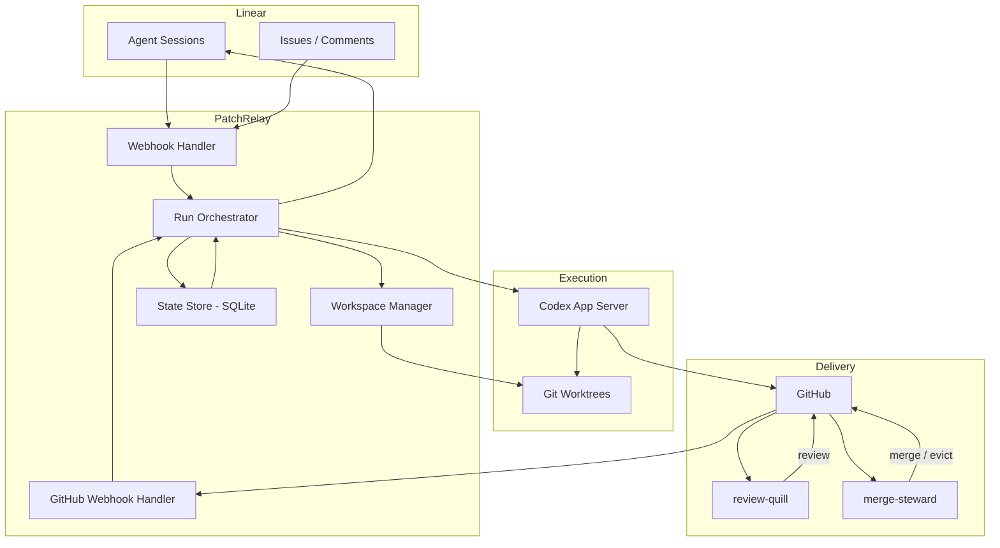

# PatchRelay Architecture

## Scope

This document covers the `patchrelay` harness specifically: what it owns, how it is structured, and how issue lifecycles flow through it. For the stack-level overview (patchrelay + review-quill + merge-steward), see the [README](../README.md) and [merge-queue.md](./merge-queue.md).

The harness is not a generic prompt runner. It is the deterministic orchestration layer that turns a delegated Linear issue into a linked pull request and keeps that PR healthy until merge or close. Review and merge execution live in separate services.

## Architectural priorities

1. **Agent legibility over cleverness** — the system should be easy for an agent to reason about without studying the internals.
2. **Flat, direct orchestration over layered abstraction** — orchestrators, handlers, and service shells stay narrow; extract by responsibility before layering. See [architecture-guardrails.md](./architecture-guardrails.md) for the extraction rules.
3. **Persistent issue workspaces** — one durable worktree per issue lifecycle, resumed across iterations.
4. **Repair loops as first-class workflows** — `implementation`, `review_fix`, `ci_repair`, `queue_repair` have distinct context, entry conditions, and success criteria, not one generic "try again."
5. **Repository-local guidance as the source of truth** — `IMPLEMENTATION_WORKFLOW.md`, `REVIEW_WORKFLOW.md`, and repo-local docs define how the agent should work in that repo.

Design lineage (OpenAI harness engineering patterns, Linear's official agent demo, community long-running agent harnesses) and the decisions behind these priorities are in [design-docs/core-beliefs.md](./design-docs/core-beliefs.md) and [references/external-patterns.md](./references/external-patterns.md).

## Component topology



## Source layout

The codebase uses a flat module structure rather than a layered directory hierarchy:

- `factory-state.ts` — state machine types and transitions
- `run-orchestrator.ts` — run lifecycle, Codex thread management, reconciliation
- `webhook-handler.ts` — Linear webhook processing, delegation, agent sessions
- `github-webhook-handler.ts` — GitHub webhook processing, reactive run triggers
- `service.ts` — top-level service wiring
- `service-runtime.ts` — async queues, background reconciliation
- `db.ts` — SQLite persistence (issues, runs, webhooks, thread events)
- `http.ts` — Fastify HTTP server and routes

## Core responsibilities

### Webhook Handler (`webhook-handler.ts`)

Owns:

- Linear webhook verification
- webhook idempotency
- OAuth app installation (via `webhook-installation-handler.ts`)
- conversion from Linear webhook payloads to normalized events
- delegation detection and implementation run scheduling
- agent session acknowledgment, plan publishing, and activity emission
- comment and prompt forwarding to active Codex runs
- preserving high-signal session context from Linear webhooks for run startup

### GitHub Webhook Handler (`github-webhook-handler.ts`)

Owns:

- GitHub webhook signature verification
- PR state tracking (number, URL, review state, check status)
- triggering reactive runs on linked delegated PR follow-up events
- repair counter management

### Run Orchestrator (`run-orchestrator.ts`)

Owns:

- run lifecycle (create, launch, complete, fail)
- Codex thread and turn management
- worktree preparation and setup hook execution
- prompt construction from issue metadata and workflow files
- packaging verification evidence for the current run type
- retry budget enforcement and escalation
- reconciliation of active runs after restart
- Linear activity and plan updates during runs
- translating Codex run outcomes into concise Linear-visible state summaries

### Workspace Manager (`worktree-manager.ts`)

Owns:

- `git worktree` lifecycle
- worktree path conventions
- branch creation and reuse

### Codex Runtime (`codex-app-server.ts`)

Owns:

- starting and monitoring Codex execution via JSON-RPC
- thread start, turn start, turn steering
- notification handling (turn/completed events)
- exposing thread, turn, and item state that can be reduced into human-facing status summaries

Prompting is split across two layers:

- durable PatchRelay rules in Codex `developerInstructions`
- a lean per-run prompt with the current objective, constraints, runtime context, workflow pointer, and publish target

This keeps stable harness policy out of every task turn while still letting PatchRelay inject the exact GitHub, Linear, and repair evidence relevant to the current run.

## Ownership

PatchRelay keeps ownership simple:

- workflow truth comes from factory state plus GitHub facts
- automation authority comes from current Linear delegation to PatchRelay

PatchRelay persists one explicit authority bit:

- `delegatedToPatchRelay`

`delegatedToPatchRelay` decides whether PatchRelay may actively write or repair code right now.

Once a PR is linked to an issue, delegation decides whether PatchRelay may actively repair it.
That PR may have been opened by PatchRelay, a human, or another external system.

When an issue is undelegated:

- active PatchRelay runs must stop
- pending PatchRelay wakes must clear
- PatchRelay must stop starting new implementation or repair runs
- PatchRelay must continue ingesting GitHub truth for the issue
- local no-PR work should keep its literal state such as `delegated` or `implementing`
- PR-backed states such as `pr_open`, `changes_requested`, and `awaiting_queue` should remain visible when still true

That observer-only mode is important because downstream services keep operating from PR truth:

- `review-quill` remains PR-centric
- `merge-steward` remains PR-centric

Re-delegation should resume from current truth, not from a generic “start over” state.
If an external PR appears on a different branch, PatchRelay can link it when the webhook carries one unambiguous tracked issue key for the same project.

## Issue lifecycle

### Main flow

```text
Delegated in Linear
-> Session acknowledged
-> Plan published
-> Worktree prepared
-> Implementation run (Codex)
-> PatchRelay opens draft PR
-> PatchRelay marks PR ready when implementation is complete
-> review-quill reviews ready PRs with green CI
-> merge-steward queues ready PRs with green CI and approval
-> If requested changes, red CI, or merge-steward incident lands on a linked delegated PR, PatchRelay resumes the same branch
-> Merged → done
```

### Reactive loops

#### Review fix loop

Triggered by:

- GitHub `review_changes_requested` event

Behavior:

- resume same worktree and branch
- start a `review_fix` run with reviewer feedback as context
- Codex addresses the feedback and pushes

#### CI repair loop

Triggered by:

- GitHub `check_failed` event

Behavior:

- start a `ci_repair` run in the same worktree
- Codex reads failure logs, fixes the code, pushes
- budget: 2 attempts before escalation

This loop must not start while the issue is undelegated, even though GitHub check state should still be recorded.

#### Queue repair loop

Triggered by:

- merge-steward eviction — a `merge-steward/queue` check run with failure status

Behavior:

- PatchRelay detects the check run failure and starts a `queue_repair` run in the same worktree
- Codex reads the steward's failure context, fixes the code, pushes
- PatchRelay re-adds the `queue` label so the steward can re-admit the PR
- budget: 2 attempts before escalation

This loop must also respect `delegatedToPatchRelay`. merge-steward may continue reporting queue truth on undelegated PRs, but PatchRelay should only repair when authority is restored.

## Factory state machine

**Current**, as defined in `factory-state.ts`:

```text
delegated → implementing → pr_open → awaiting_queue → done
             ↘ changes_requested ↗
             ↘ repairing_ci ↗
awaiting_queue ↘ repairing_queue ↗

terminal exits:
- awaiting_input
- escalated
- failed
```

**Target** (in-progress simplification): a smaller `IssueSession` machine where waiting on review or queue is a `waitingReason` rather than a top-level state:

- `idle`
- `running`
- `waiting_input`
- `done`
- `failed`

The live code still carries the broader factory-state model above. The simplification is happening in steps and tracked as refactors.

### Undelegation semantics

For undelegated issues:

- no PR yet — preserve the literal local-work state and expose a paused waiting reason
- PR exists — preserve the PR-backed factory state and expose a paused waiting reason

That keeps operator-facing state truthful without letting PatchRelay continue writing code. `awaiting_input` is reserved for real human-needed states, not generic paused local work.

## Failure taxonomy

### Repairable automatically

- formatting or lint failures
- deterministic test failures
- straightforward rebase conflicts

### Escalate quickly

- ambiguous product decisions
- repeated semantic integration failures
- broken credentials or revoked installations
- repository setup hook failures that block all progress

## State storage

PatchRelay uses SQLite. Current tables:

- `issues` — one record per tracked issue: factory state, PR state, run pointers, repair counters
- `runs` — one record per Codex run (`implementation`, `review_fix`, `ci_repair`, `queue_repair`)
- `webhook_events` — deduplication and processing status for Linear webhooks
- `run_thread_events` — per-run transcript of Codex thread events (when extended history is enabled)
- `linear_installations` — OAuth credentials and installation metadata
- `operator_feed_events` — event log for the operator CLI

GitHub remains the source of truth for PR readiness, review, and merge state — PatchRelay stores derived state to correlate Linear issues with local workspaces and runs, not to duplicate GitHub.

## No-PR completion check

Implementation runs now have one lean fallback path when no PR is linked at turn completion:

1. the main run finishes
2. PatchRelay checks whether a PR was published
3. if no PR was observed, PatchRelay forks the thread once for a `completion check`
4. the fork returns one typed outcome:
   - `continue`
   - `needs_input`
   - `done`
   - `failed`

This is the only supported no-PR decision path.

The completion check is intentionally secondary and read-only:

- it runs in a read-only fork
- it must not execute tools or edit the repository
- it exists only to decide the next step after a no-PR outcome

Observability is intentionally split by surface:

- dashboard: `No PR found; checking next step` and the final completion-check result
- Linear: only persistent human-relevant outcomes such as `needs_input`, valid no-PR `done`, or `failed`
- run/session logs: fork thread id, turn id, and typed completion-check result

## Workflow files

The target repository (the one PatchRelay is implementing for) should contain:

- `IMPLEMENTATION_WORKFLOW.md` — guidance for implementation, CI repair, and queue repair runs
- `REVIEW_WORKFLOW.md` — guidance for review fix runs

The run orchestrator points Codex at these files from the lean per-run scaffold rather than inlining them into every turn. Keep them short and action-oriented. See [prompting.md](./prompting.md) for how they compose with `developerInstructions` and the built-in scaffold.

## Design implications

- One owning agent per issue branch keeps coordination manageable.
- Delegation does not automatically imply "this issue must own a branch and PR"; tracker and orchestration issues may complete without opening code.
- The same worktree is resumed for all iterations of an issue — not a fresh clone per run.
- Queue failures are integration problems, not just CI failures — they get their own `queue_repair` loop.
- The repository is part of the harness. If an agent cannot rediscover a rule in-repo, the rule is operationally weak. Keep root docs navigational and treat deeper `docs/` material as the durable system of record.
- Historical designs are reference material only unless reaffirmed in current docs.
- Preserve compact verification evidence (failing check names, review comments, queue incidents) rather than replaying ever-growing transcripts.
- Linear communication stays high-signal: immediate acknowledgment, concise in-flight activity, lifecycle-aware plans; deeper status lives behind session links, not in transcript dumps.
