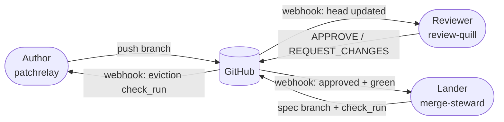
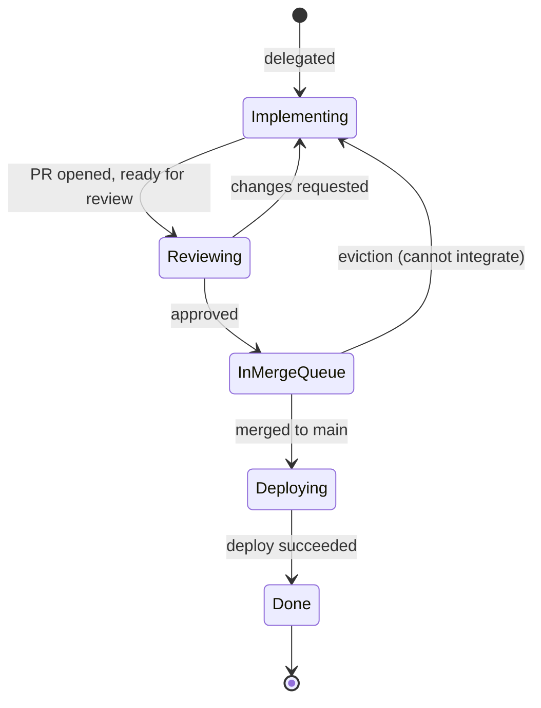
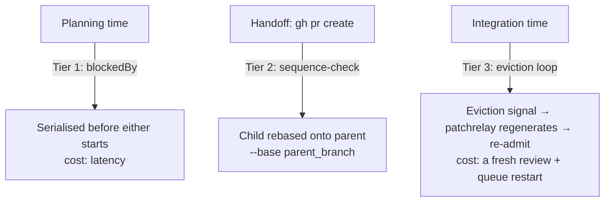

# Concepts

The shared mental model behind PatchRelay, review-quill, and merge-steward. Each service operates independently, but they all read from the same picture of *what a change is*, *what gets reviewed*, and *what lands*. This document is the picture.

If you only read one doc to understand the stack, read this one.

## One artifact, three roles

A pull request is a Git ref. A *change* is a logical thing. The stack is built around that distinction. Three roles act on the same PR through the GitHub bus — they never call each other:



| Role | Default | Replaceable by | Responsibility |
|-|-|-|-|
| Author | `patchrelay` | A human, Cursor, Claude Code, Codex CLI | Produces commits on a PR branch. Reacts to "that's not right" and to "that won't integrate." |
| Reviewer | `review-quill` | Copilot Code Review, CodeRabbit, a human, any other GitHub PR review producer | Decides if a change is correct. Verdict attaches to the change, not to a SHA. |
| Lander | `merge-steward` | Mergify, Aviator, Bors, GitHub native merge queue | Tests the integrated tree against current `main`. Advances `main` when green. |

All three roles share the same five GitHub artifacts (the *bus*). All five names are configurable per project — see [github-queue-contract.md](./github-queue-contract.md). Defaults preserve current behaviour.

## Four primitives

The model rests on four Git-native ideas. Each is just a thin name on top of something Git already gives you.

### 1. A commit is a tree plus a parent

Git stores snapshots, not diffs. Every commit points to a *tree* — the full state of the repo at that moment — plus the parent commit(s) it descends from. The *diff* you read in a review is computed: `tree(child) − tree(parent)`. It's a derived view, not the artifact.

This matters because the question *"does my change still make sense after main moved?"* is really a question about *which two trees you compare*.

### 2. The integration tree

When your branch lands on `main`, the result is a new tree — `main` plus your change, woven together. That tree exists whether you've built it or not. We call it the **integration tree**:

```
integration_tree = git merge-tree --write-tree <main> <pr-head>
```

No working directory, no merge commit, no side effects. Pure function: `(main, head) → tree`.

The integration tree is what the lander tests. It is what reviews can optionally target (see *Two review surfaces* below). It is what `main` will fast-forward to.

Non-zero exit from `git merge-tree` means *cannot integrate* — a real conflict signal, not an error condition.

### 3. patch-id — the identity of a change

Two commits represent the *same change* when the diff they produce against their merge-base is identical. Git already has a built-in for this:

```
patch_id = git diff $(git merge-base <base> <head>)..<head> | git patch-id --stable
```

Same `patch_id` = same change. Even after rebase, amend, cherry-pick, or force-push that only reorders commits.

What it ignores (on purpose): commit messages, author/dates, parent SHAs, the base branch.

What changes it (on purpose): edits to the diff itself — including conflict resolutions.

`--stable` (not bare `git patch-id`) canonicalises per-file order so commit reorders within a range produce the same id.

### 4. Landing is a pointer move

If `main` is an ancestor of some commit C, and C has been tested in the form it'll land in, then "merging" is just:

```
git push origin C:main
```

Atomic. Cheap. No merge button. No new commit on top.

The merge work — building the integration tree, running CI on it — happens *before* the pointer moves. By the time `main` advances, there is nothing left to test.

> *Main is a tag. We move it through commits we trust.*

## Five states

The three roles map onto five workflow states in Linear, in lifecycle order. The phase is obvious from both Linear (the state) and GitHub (PR labels and checks) at any moment.



| State | Owner | What's happening |
|-|-|-|
| Implementing | Author | A patchrelay run (or human) is producing or revising the change — including addressing review/CI/queue feedback. |
| Reviewing | Reviewer + branch CI | review-quill verdict and configured required checks working until both green. |
| In Merge Queue | Lander | merge-steward holds the issue **pre-merge**: spec built, spec CI, awaiting its turn, then merging. Visible on GitHub via `queue:testing` / `queue:merging` labels. |
| Deploying | Deploy | The change is **on main** and the deploy workflow is running. |
| Done | — | The deploy succeeded. |

Two ways back to Implementing: the reviewer asks for changes, or the lander can't integrate (eviction).

Every state is decided from durable signals — `factoryState`, `prState`, the review verdict — never from whichever transient webhook happens to fire. The state moves only on a real lifecycle handoff, so it does not flap.

If a project's Linear workflow omits a state, the issue collapses to the nearest earlier phase and PatchRelay never invents a state that doesn't exist: without **In Merge Queue** the issue stays in Reviewing with a `queued-for-deploy` sub-label (configurable; see [github-queue-contract.md](./github-queue-contract.md)); without **Deploying** a merged issue advances straight to Done.

Deploying is **opt-in** per project: set `github.deployWorkflowName` to the GitHub Actions workflow that deploys `main`. PatchRelay then holds the merged issue in Deploying and watches that workflow's runs on the base branch — success advances to Done, failure escalates to Human Needed, and a 20-minute timeout completes the issue if no deploy ever runs (the change is already on `main`). With no `deployWorkflowName`, a merge completes immediately.

The factory's internal `factoryState` codes (`pr_open`, `awaiting_queue`, `repairing_queue`, …) map onto these five — see [architecture.md](./architecture.md#factory-state-machine).

## The author rule — don't originate redundant pushes

When a run finishes, compute the `patch_id` of what it produced. If it equals the last published `patch_id` on this branch, the run had nothing to add — complete cleanly, no push.

This is a *behaviour rule* about what runs produce, not a hard gate on `git push`. Republishing the same change isn't harmful; it's just pointless when the run had no new content.

What this kills:

- **Rebase to chase main.** The lander handles base advance. The Author shouldn't initiate a republish just because main moved.
- **"Make the fix unmistakable" cosmetic re-pushes** onto an already-approved head. The run produces no new `patch_id`, so it doesn't push.

What stays allowed:

- Operator-initiated rebase to unstick a stale PR.
- Forcing a fresh CI run on a known flake (`gh run rerun`).
- Branch hygiene (squashing WIP commits).

The Reviewer carries approvals across patch-id-equivalent heads, so the cost of these is small even when they happen.

## The reviewer rule — carry the verdict across rebases

Index approvals by `patch_id` (and, in integration-tree mode, by `(patch_id, integration_tree_id)`). On a new head:

```
same identity   →  re-emit the prior verdict. no review.
different       →  fresh review.
```

Without carry-forward, every rebase onto fresh main triggers a fresh model-driven review. With it, trivial rebases are free.

A PR carrying the configured no-cache label (default `review:no-cache`) is always re-reviewed even when the patch is unchanged — useful for release / changelog PRs that need a fresh body rendering.

### Two review surfaces, two cache shapes

The Reviewer can target one of two surfaces. The cache key must match the surface; mixing them produces incorrect carry-forward.

| Mode | Reviewer reads | Cache key | When base advances |
|-|-|-|-|
| `head` (default) | The PR head's diff against its base | `patch_id` only | Verdict carries; semantic merge issues are caught at integration time by spec CI |
| `integration_tree` (opt-in) | The synthetic merged tree | `(patch_id, integration_tree_id)` | Most rebases re-review (the integrated tree changes when main moves), but semantic merge issues are caught at *review* time |

Default is `head` — Gerrit's trivial-rebase rule. Set `reviewSurfaceMode: "integration_tree"` in the per-repo review-quill config to opt in.

## The lander rule — test the tree that will land

The lander builds the integration tree, wraps it in a commit on a spec branch (`mq-spec-<entry-id>`), and runs CI on *that*. The PR head is irrelevant to the merge gate.

```
tree   = merge-tree(main, pr-head)
commit = commit-tree(tree, parents=[main, pr-head])
push   spec/<n> → GitHub
run    CI on spec/<n>

green  →  push spec/<n> → main   (fast-forward)
fail   →  emit eviction signal (merge-steward/queue check_run)
```

When two PRs are queued, the second's spec is built on top of the first's spec — not on main. CI tests *"what would land if everything ahead of me lands."* When the head spec lands, main fast-forwards through it. The next spec is already a fast-forward from the new main.

Each rung of the train is a tested integration tree.

## The eviction rule — the only signal that returns In Merge Queue to Implementing

Once an issue is **In Merge Queue**, branch CI on the PR head is *metadata*. The lander is testing a different SHA. The Author does not react to red branch CI in this window — it might be a flake the spec doesn't hit, or a real failure the spec also hits.

The only signal that returns the issue to Implementing is the eviction `check_run` (default name `merge-steward/queue`):

| Window | Branch CI red on PR head | Author reaction |
|-|-|-|
| Reviewing | Required checks block admission | Re-run if flaky (`gh run rerun`); push a fix if real |
| In Merge Queue | Metadata only | Wait. Either the spec hits it (eviction) or it was a flake (lands clean) |

This rule is enforced both at the state-machine table (`failureSource === "branch_ci" && state !== "awaiting_queue"`) and in workflow-task derivation. See [architecture.md](./architecture.md#failure-taxonomy).

## Sequencing — three tiers for predictable conflicts

Two PRs that touch the same lock file, the same migration, or the same shared helper will conflict at integration time. The eviction loop catches it, but every cycle costs a fresh review and a queue restart. For predictable conflicts, the cleaner answer is to **never let them race**.



| Tier | When | Mechanism | Cost |
|-|-|-|-|
| 1 | Planning | `B blockedBy A` in Linear; PatchRelay won't start B until A is Done | Latency |
| 2 | Handoff (`gh pr create`) | `patchrelay sequence-check` runs `git merge-tree` against in-flight PRs, recommends rebasing onto the most-likely-to-land-first conflicting parent | One probe per candidate |
| 3 | Integration | Lander hits a real conflict, evicts via `merge-steward/queue` check_run; PatchRelay's `queue_repair` regenerates and re-submits | One eviction cycle |

The three tiers are not mutually exclusive. Tier 1 is cheapest when the conflict is predictable. Tier 2 covers the cases only visible at run-end. Tier 3 is the safety net.

## Stacks, not a "Stack object"

Once we sequence PRs, stacked PRs exist in the factory. They are *not* a new first-class concept. The chain is expressed through two artifacts that already exist:

- A Linear `blockedBy` edge — declares the dependency at planning time.
- A PR's `base` ref — declares it at the GitHub layer (`B.base = A.branch`).

That's the whole contract. Every actor reads the chain from those two places. No new tables, no new factory states, no "stack id," no new CLI verbs.

For a stacked PR, the diff base is the parent PR's head, not main. Everything else flows from that one substitution:

```
non-stacked:   integration_tree = merge-tree(main, head)
stacked:       integration_tree = merge-tree(parent_PR_head, head)
```

The cache-key shape, the eviction contract, and the state machine are unchanged. When a parent PR's head moves, PatchRelay rebases the child via the existing `branch_upkeep` path. When the parent merges, GitHub auto-retargets the child's base to main and the stack collapses by one rung.

## How the four primitives eliminate observed waste

Five waste classes were directly observed in production transcripts (LSR-272 / LSR-278 / LSR-279 / LSR-281 / LSR-284) and all were addressed by mechanisms that fall straight out of the model:

| Observed waste | Mechanism that eliminates it |
|-|-|
| Re-review on rebase | Carry-forward by `patch_id` — same change, same verdict |
| Chase-rebase loop on already-approved PRs | The Author rule: no patch-id-equivalent push originated by the agent |
| `ci_repair` fired during In Merge Queue on flaky branch CI | The eviction rule: branch CI is metadata while In Merge Queue |
| Cosmetic re-push dismisses a fresh approval mid-run | Mid-run approval cancellation: when an approval lands on the run's source SHA, the run is superseded and `shouldNotPublish` blocks the finalizer |
| Lock-file conflicts caught only at integration time | Tier 1 (`blockedBy`) and Tier 2 (`sequence-check`) |

## Where to read next

- [github-queue-contract.md](./github-queue-contract.md) — the bus artifacts, configurable names, identity algorithms.
- [merge-queue.md](./merge-queue.md) — the end-to-end story across all three services.
- [architecture.md](./architecture.md) — patchrelay internals, factory state, run types, ownership.
- [review-quill.md](./review-quill.md) and [merge-steward.md](./merge-steward.md) — operator references.
- [operator-guide.md](./operator-guide.md) — the operator alert vocabulary and daily loop.
