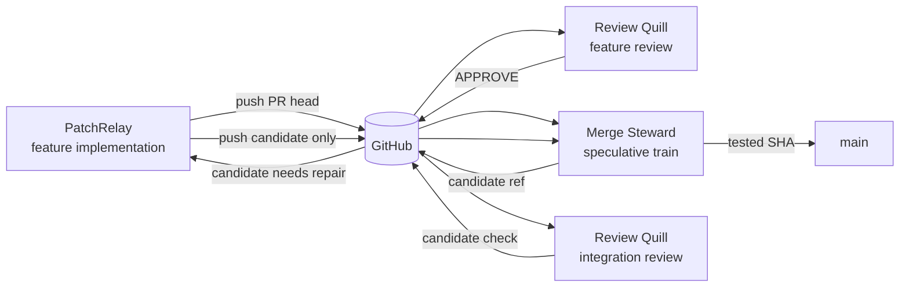
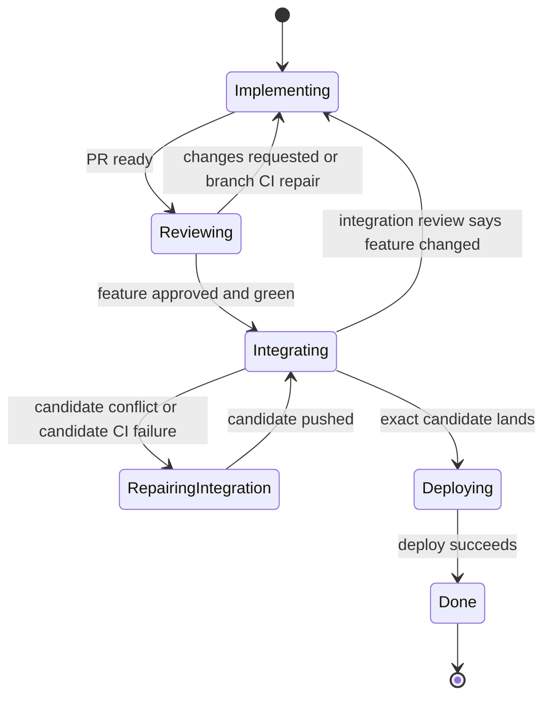

# Concepts

The shared mental model behind PatchRelay, review-quill, and merge-steward.
The services are independent reconcilers over GitHub state: webhooks wake them
up, but do not command them, and no service calls another service's API.

If you only read one document to understand the stack, read this one.

## Two tracks, three roles

Delivery has two deliberately separate tracks:

1. **Feature development** changes the PR branch until branch CI is green and
   the feature receives a substantive review approval.
2. **Integration** freezes that approved PR head, composes it with the exact
   prospective `main`, repairs only the integration result when necessary,
   validates that exact candidate, and lands it.


```mermaid
flowchart LR
    P[PatchRelay<br/>feature implementation] -->|push PR head| GH[(GitHub)]
    GH --> R[Review Quill<br/>feature review]
    R -->|APPROVE| GH
    GH --> M[Merge Steward<br/>speculative train]
    M -->|candidate ref| GH
    GH -->|candidate needs repair| P
    P -->|push candidate only| GH
    GH --> IR[Review Quill<br/>integration review]
    IR -->|candidate check| GH
    GH --> M
    M -->|tested SHA| Main[main]
```

| Role | Default | Responsibility |
|-|-|-|
| Author | PatchRelay or a human | Implement the feature and repair review or branch-CI failures on the PR branch. Repair integration failures on the candidate ref without changing the approved PR head. |
| Reviewer | review-quill or a human | Review the feature once; after an integration repair, review only whether the approved feature survived integration. |
| Lander | merge-steward | Order the queue, build cumulative candidates, publish candidate refs, validate exact candidate SHAs, and advance `main`. |

## The four Git-native primitives

### 1. The approved feature

Feature review binds to a PR head. After approval and green branch CI that head
is frozen for the integration track. Moving `main` does not change the approved
feature and must not cause PatchRelay to rebase or force-push the PR branch.

`patch_id` remains a small optimization for feature review. A head rewrite with
the same patch can carry the prior verdict; a changed patch receives a fresh
feature review. Once the approved head is in the integration track, ancestry to
that exact head is the simpler proof that the candidate includes the feature.

### 2. The prospective base

The first queue entry is based on the current `main`. Every later entry is
based on the preceding candidate:

```text
base(A) = main
base(B) = candidate(A)
base(C) = candidate(B)
```

This is a speculative train. Candidates may validate in parallel, but they land
in order. If a predecessor candidate changes, its downstream candidate closure
is stale and is rebuilt; no feature approval is invalidated.

### 3. The integration workspace

Every queued PR has a self-describing GitHub ref:

```text
merge-steward/<base-branch>/pr-<number>
```

The ref is both the candidate and the integration workspace. Its Git ancestry
is the cross-service state protocol:

| Ref state | Meaning |
|-|-|
| Ref absent | No active integration candidate for this PR. |
| Ref equals the prospective base and does not contain the approved PR head | Candidate construction conflicted; PatchRelay must integrate the frozen head here. |
| Ref contains the approved PR head | A candidate exists; its exact SHA may be reviewed, tested, and landed. |
| Ref no longer descends from the current prospective base | The train moved; Merge Steward must rebuild it. |

Merge Steward may reset a stale workspace. PatchRelay may only make ordinary
non-force pushes to it. A stale PatchRelay push therefore fails naturally when
Merge Steward has already moved the ref; Git supplies the concurrency fence.

For any PR, any effective GitHub approval on the exact current PR head,
including a human approval, plus green branch CI grants PatchRelay authority to
repair only this integration workspace. Linear delegation is not required for
that candidate-only work. The grant never authorizes changing the PR branch or
resuming feature implementation.

### 4. Exact-SHA validation and landing

Checks authorize a commit SHA, never a mutable branch name. If the prospective
base is already an ancestor of the approved PR head, the head itself is the
candidate and its exact-SHA checks are reusable. Otherwise the candidate is an
integration commit on the workspace ref.

If an exact-head candidate later needs landing-policy test repair, Merge
Steward publishes the workspace ref at that approved head. PatchRelay can then
add a candidate-only repair without rewriting the PR branch.

Immediately before landing, Merge Steward refreshes GitHub truth and verifies:

- the PR is still open and its approved head is unchanged;
- the candidate contains that approved head;
- the candidate descends from the current prospective base;
- required candidate checks are green;
- `review-quill/integration` is green when PatchRelay changed the candidate;
- current `main` can be fast-forwarded to the same immutable candidate SHA.

Landing is then a non-force pointer move. If `main` moved first, the candidate
is rebuilt; the feature is not re-reviewed.

## Workflow states


```mermaid
stateDiagram-v2
    [*] --> Implementing
    Implementing --> Reviewing: PR ready
    Reviewing --> Implementing: changes requested or branch CI repair
    Reviewing --> Integrating: feature approved and green
    Integrating --> RepairingIntegration: candidate conflict or candidate CI failure
    RepairingIntegration --> Integrating: candidate pushed
    Integrating --> Implementing: integration review says feature changed
    Integrating --> Deploying: exact candidate lands
    Deploying --> Done: deploy succeeds
    Done --> [*]
```

Integration conflict and candidate-CI failure are not feature failures. They
stay in the integration track. Only a finding that the repair materially
changes the approved feature returns the issue to implementation and full
feature review.

## Review rules

### Feature review

Review Quill reviews the PR diff and wider product context. A changed feature
patch invalidates the feature verdict. A patch-equivalent rewrite may carry it
forward. Base movement by itself is handled in integration and does not ask the
feature reviewer to review the feature again.

### Integration review

A mechanically created clean candidate needs exact-candidate CI but no second
feature review. A candidate changed by PatchRelay receives a narrow review on
the candidate SHA. The reviewer answers one question:

> Did the integration preserve the already-approved feature while correctly
> composing it with the prospective base?

The result is the SHA-bound `review-quill/integration` check:

- `success` — integration preserved the approved feature;
- `failure` — the repair materially changed the feature and it must return to
  implementation.

The check may contain findings for the agent and operator, but its name, SHA,
and conclusion are sufficient for routing.

## CI rules

- Branch CI is an admission proof for the approved feature head.
- Candidate CI is the landing proof for the exact future-`main` SHA.
- If candidate SHA equals the approved head SHA, reuse its successful checks.
- Otherwise run required checks on the candidate.
- Never run the same required suite twice for the same SHA and policy.
- After that SHA becomes `main`, main CI is informational; only checks with a
  different purpose, such as deploy or production smoke, add new evidence.
- A failed candidate may be repaired repeatedly in its integration workspace.
  Each new SHA needs current candidate checks, but not a new feature review.

## Speculative failure behavior

For a train `A -> B -> C`, a red candidate B remains in place while PatchRelay
repairs it. A may land. C cannot land before B. If B's SHA changes, C is rebuilt
on the new B; if B conflicted before any candidate existed, C waits until B has
one. The queue does not silently skip B merely because integration needs work.

Eviction is reserved for product ambiguity, policy failure, explicit operator
removal, an exhausted repair budget, or an integration review proving that the
feature itself must change. Ordinary conflicts and test failures are repairable
integration states.

## GitHub is the protocol

Labels, comments, and service-to-service requests are not control messages.
Each service derives work from current PR heads, reviews, candidate refs,
ancestry, and SHA-bound checks on startup, periodic reconciliation, or webhook
wakeup. Losing a webhook delays convergence but cannot change the outcome.

See [github-queue-contract.md](./github-queue-contract.md) for the exact state
table and [merge-queue.md](./merge-queue.md) for the end-to-end lifecycle.
