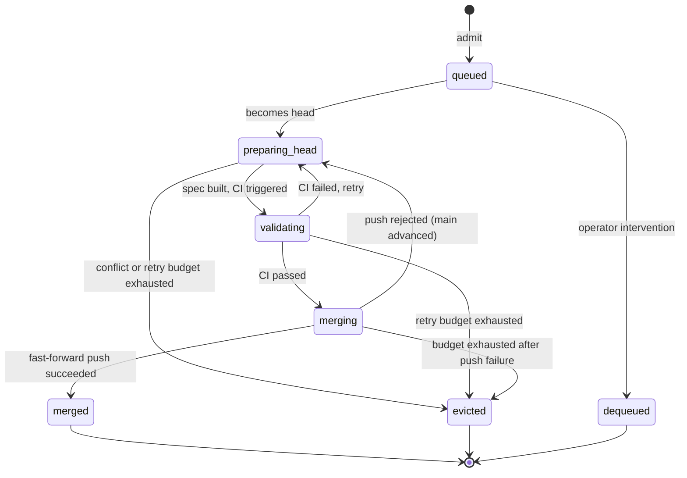

# PR delivery pipeline

Three independent services handle the path from "PR exists" to "merged on `main`":

- **patchrelay** develops code and produces pull requests. Owns issue worktrees, agent runs (implementation, review fix, CI repair), and Linear session UX.
- **review-quill** reviews every merge-ready head and publishes an ordinary GitHub `APPROVE` or `REQUEST_CHANGES` review.
- **merge-steward** admits approved, green PRs into a serial merge queue, speculatively integrates each one on top of the current `main`, validates, and fast-forwards.

Neither downstream service calls the other's API, and neither calls patchrelay. GitHub is the shared bus — PR state, reviews, checks, and branch changes are the protocol. Each service is independently usable; a repo can adopt any subset.

For the *mental model* (three roles, four primitives, the carry-forward and eviction rules), see [concepts.md](./concepts.md).

For the *concrete shared artifacts and ownership boundaries*, see [github-queue-contract.md](./github-queue-contract.md).

## Why split the pipeline

The merge queue is a deterministic control problem that should keep making progress even when agent execution is unavailable, degraded, or expensive.

Observed behavior showed patchrelay spent far more work on orchestration churn (173/232 runs in an early batch) than on real code repair. Splitting the queue from the agent harness:

- keeps the model where it helps (issue implementation and repair)
- removes it from the part that most needs simple, restart-safe, auditable control (queue advancement)
- allows the steward to be a pure reconciliation loop

PR review was split out for the same reason: it has its own decision surface (approve/decline), its own failure mode (stale reviews on an old head), and its own natural frequency. Running it as a dedicated service keeps each loop simple.

See the design docs for the full analysis: [design-docs/merge-steward.md](./design-docs/merge-steward.md), [design-docs/review-quill.md](./design-docs/review-quill.md).

## End-to-end lifecycle

```mermaid
sequenceDiagram
    participant A as Author<br/>(patchrelay / human)
    participant GH as GitHub
    participant RQ as Reviewer<br/>(review-quill)
    participant MS as Lander<br/>(merge-steward)

    A->>GH: Push branch, open PR
    GH-->>RQ: webhook: PR opened / head updated

    alt Same patch_id as a prior approved attempt (carry-forward)
        RQ->>GH: Re-publish prior verdict (no Codex turn spent)
    else New patch_id
        RQ->>GH: Checkout head SHA in throwaway worktree
        RQ->>GH: Submit APPROVE / REQUEST_CHANGES review
    end

    Note over A,MS: If APPROVE + required checks green:
    GH-->>MS: webhook: review approved / checks green
    MS->>GH: Admit to queue (DB record)
    MS->>GH: Build spec branch mq-spec-N (merge of main + PR)
    MS->>GH: Push spec, emit merge-steward/spec-ready check_run
    Note over RQ: review-quill sees spec-ready;<br/>in integration_tree mode, targets the spec SHA
    GH-->>MS: webhook: check_suite completed on spec

    alt CI green on spec
        MS->>GH: Fast-forward push spec SHA → main
        Note over MS,GH: main now points at the tested SHA
    else CI red on spec
        MS->>GH: Retry (if base SHA changed) or evict + emit merge-steward/queue check_run
        GH-->>A: eviction check_run visible on PR
        A->>GH: Fix branch, push new head → loop restarts
    end
```

This sequence is built on the four primitives described in [concepts.md](./concepts.md): a commit's tree, the integration tree, `patch_id`, and fast-forward landing. The two carry-forward branches (re-publish vs fresh review) and the spec-ready check are the ways those primitives surface on the bus.

## Queue state machine



States:

| State | Meaning |
|-|-|
| `queued` | Admitted; waiting in line |
| `preparing_head` | Building the speculative branch on top of `main` (or the previous entry's spec) |
| `validating` | CI running on the speculative SHA |
| `merging` | Revalidating approval + attempting fast-forward push to `main` |
| `merged` | Done — `main` now points at the tested SHA |
| `evicted` | Failed after retries; durable incident created, GitHub check run emitted |
| `dequeued` | Manually removed by an operator |

## What this pipeline eliminates

The pipeline is built around five rules that fall out of the four primitives. Each rule maps to a specific class of waste that was directly observed in production transcripts before the merge-trees rollout:

| Rule | Where it lives | Waste it eliminates |
|-|-|-|
| Carry the verdict by `patch_id` | review-quill `service.ts` carry-forward gate | Re-review on rebase against fresh main |
| Don't originate redundant pushes | patchrelay run-finalizer (`shouldNotPublish` + post-hoc `patch_id` detection) | Cosmetic re-pushes that dismiss approvals |
| Branch CI is metadata once In Merge Queue | patchrelay state-machine table + reactive enqueue guard | `ci_repair` runs fired on flaky branch CI while the lander already has the PR |
| Cancel a run when an approval lands on the run's source SHA | patchrelay `superseded` RunStatus + finalizer publication block | Mid-run race where a fresh approval is dismissed by a still-running review-fix push |
| Test the integration tree, not the head | merge-steward speculative branch (`mq-spec-*`) | Green PR head that breaks main after fast-forward |

Three sequencing tiers prevent integration conflicts upstream of the rules above. See [concepts.md](./concepts.md#sequencing--three-tiers-for-predictable-conflicts).

## Production proof points

The merge-trees rollout is intentionally observable through ordinary PatchRelay runtime state: Linear issue state, GitHub webhook transitions, and the `runs` table. A healthy repair path should read as a small story:

```text
review-quill requests changes
PatchRelay starts review_fix
PatchRelay pushes a fresh PR head
review-quill approves the new head
merge-steward admits, validates, and merges
```

Recent production runs showed that path on real LearnSpeakRepeat work:

| Issue | What happened | Result |
|-|-|-|
| `LSR-373` | requested changes on PR #724, followed by `review_fix` runs | fresh head, approval, merge |
| `LSR-374` | requested changes on PR #722, followed by `review_fix` runs | fresh head, approval, merge |
| `LSR-375` | queue conflict on PR #726, followed by `queue_repair` | rebased fresh head, approval, merge |
| `USE-206` | repeated requested-changes repair attempts on PR #355 | no-push attempts were blocked, pushed repairs continued |

The important failure mode is now explicit. If a requested-changes run finishes without moving the remote PR head past the blocking review SHA, PatchRelay marks the run failed instead of handing the same head back to review. That failure means the guard worked: the system protected the reviewer from being asked to reconsider an unchanged head.

Look for this failure reason when auditing production:

```text
Requested-changes run finished for PR #<n> without pushing a new head past blocking review SHA <sha>;
PatchRelay must not hand the same SHA back to review.
```

## Failure and repair handoff

When the queue head fails, the steward classifies the failure before acting:

- **Flaky / infra** — retry CI without agent repair
- **Branch-local** — evict and report via `merge-steward/queue` check run
- **Integration conflict** — evict and report via check run

On eviction, the steward creates a durable incident record and a GitHub check run with failure details. Any agent with access to the branch sees the check run failure and can repair:

- **patchrelay** sees the check run, triggers a `queue_repair` run, fixes the branch, pushes a new head.
- **[ship-pr](https://github.com/krasnoperov/patchrelay-agents) skill** (supervised mode) — an agent running in Claude Code / Cursor / Codex CLI interprets `merge-steward pr status --wait` exit-2 `evicted`, reads `merge-steward queue show --pr <num>` for the incident, fixes the branch, pushes.
- **Human** — reads the check run output and refreshes the branch manually.

In all three cases, the steward re-admits the PR from fresh GitHub truth once the fresh head is approved and green again.

```text
Steward evicts PR → creates check run with failure context
Agent (patchrelay | ship-pr | human) → fixes the branch → pushes a fresh head
Steward → re-admits from fresh GitHub truth
```

When a PR is stuck or evicted, start with:

```bash
merge-steward pr status
merge-steward queue show --pr <num>
merge-steward service logs --lines 100
patchrelay issue show APP-123
```

Escalate to a human when the incident points at product ambiguity, broken credentials, branch protection policy, an unhealthy `main`, or repeated semantic failures.

## Repository settings

### Branch protection rules

Configure branch protection on the base branch (e.g., `main`):

| Setting | Value |
|-|-|
| Require a pull request before merging | Enabled |
| Require approvals | 1 (or more) |
| Require status checks to pass before merging | Enabled |
| Status checks that are required | Your CI job name (e.g., `test`) |
| Require branches to be up to date before merging | **Enabled** |
| Dismiss stale pull request approvals when new commits are pushed | **Disabled** |
| Require approval of the most recent reviewable push | **Disabled** |

If the branch restricts who can push, allow the Merge Steward GitHub App to push to the protected branch. The steward lands by fast-forwarding `main` to the already-tested speculative SHA; it does not press GitHub's merge button.

**Why "Dismiss stale approvals" can stay disabled:** the steward does not rely on rewriting the reviewed PR head as the review signal. It validates a speculative integrated SHA before landing.

**Why "Require approval of the most recent reviewable push" can stay disabled:** the approval gate is the reviewed PR head plus the steward's integrated CI gate, not a second human review of the steward's speculative branch.

If you want machine review to count toward merge admission, include `review-quill/verdict` in the required checks.

### GitHub webhooks

Each service has its own GitHub webhook:

- **patchrelay** — its own GitHub webhook for PR, review, and check events that drive reactive repair loops. Events: Push, Pull request, Pull request review, Check suite, Check run.
- **review-quill** — its own GitHub App webhook. Events: Pull request, Check run, Check suite.
- **merge-steward** — its own GitHub App webhook. Events: Pull requests, Pull request reviews, Check suites, Pushes, Branch protection rules, Repository rulesets.

See each service's operator reference for the specific App permission set and webhook URL.

## Setup

Each service bootstraps independently:

```bash
# patchrelay (the harness)
patchrelay init https://patchrelay.example.com

# review-quill (PR review)
review-quill init https://review.example.com
review-quill repo attach owner/repo

# merge-steward (the queue)
merge-steward init https://queue.example.com
merge-steward attach owner/repo
```

For service-specific configuration, see:

- [docs/review-quill.md](./review-quill.md) — operator reference
- [docs/merge-steward.md](./merge-steward.md) — operator reference
- [docs/self-hosting.md](./self-hosting.md) — patchrelay install and ingress

## Read more

- [github-queue-contract.md](./github-queue-contract.md) — shared GitHub artifacts
- [design-docs/merge-steward.md](./design-docs/merge-steward.md) — why the split and the core invariants
- [design-docs/review-quill.md](./design-docs/review-quill.md) — review service design rationale
