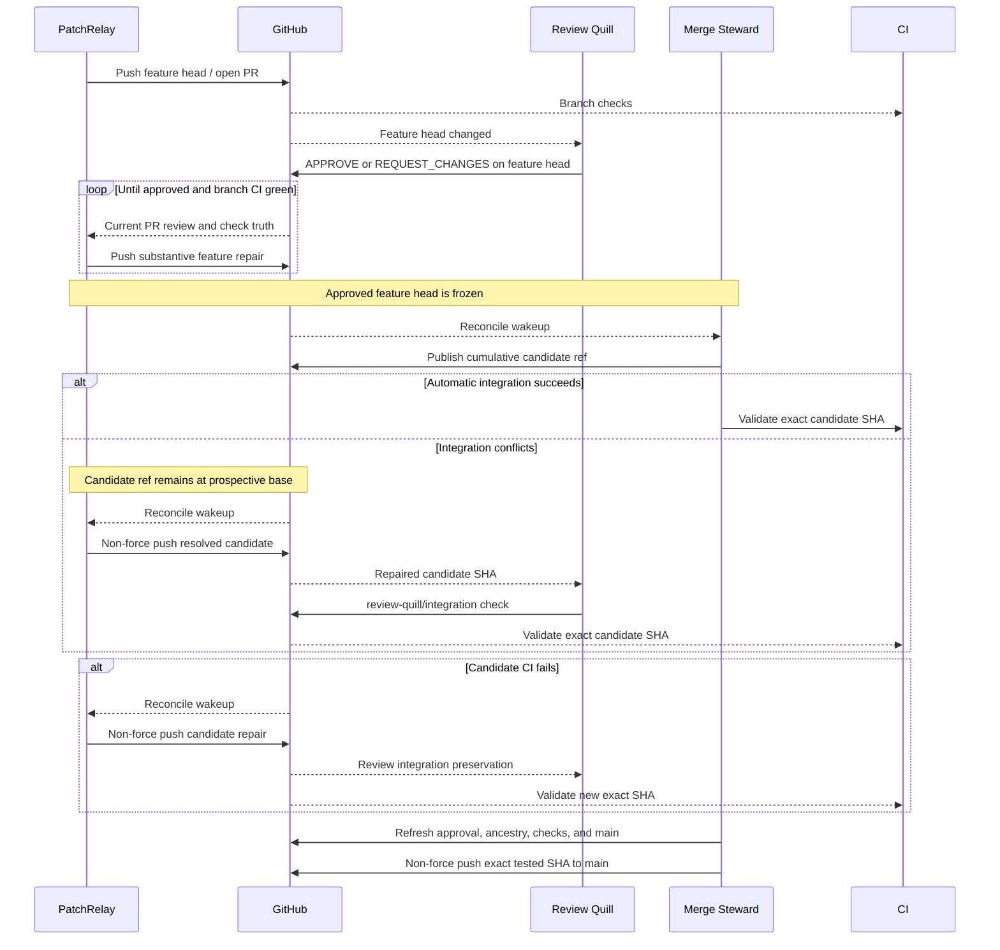
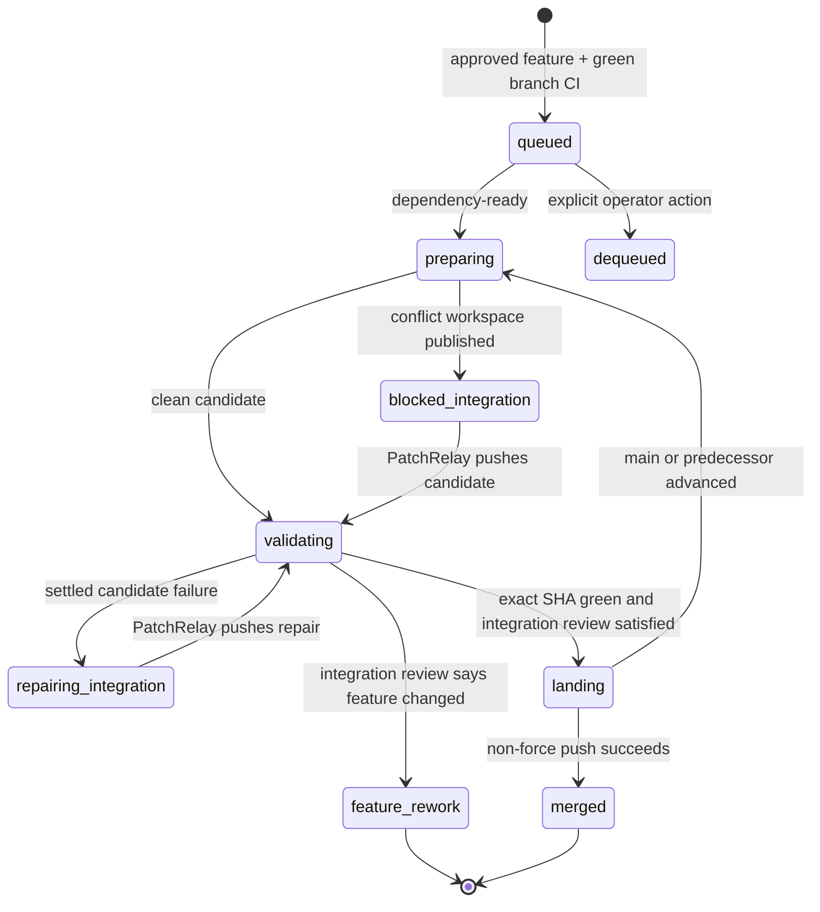

# PR delivery pipeline

PatchRelay, review-quill, and merge-steward form one delivery pipeline with two
separate tracks:

- **Feature track** — implement and substantively review the PR branch.
- **Integration track** — compose the frozen approved head with prospective
  `main`, repair only that composition, validate it, and land it.

The services share no private API. GitHub PRs, reviews, refs, ancestry, and
SHA-bound checks are the protocol. A webhook is only a reconcile wakeup.

## End-to-end lifecycle


```mermaid
sequenceDiagram
    participant P as PatchRelay
    participant GH as GitHub
    participant RQ as Review Quill
    participant MS as Merge Steward
    participant CI as CI

    P->>GH: Push feature head / open PR
    GH-->>CI: Branch checks
    GH-->>RQ: Feature head changed
    RQ->>GH: APPROVE or REQUEST_CHANGES on feature head

    loop Until approved and branch CI green
        GH-->>P: Current PR review and check truth
        P->>GH: Push substantive feature repair
    end

    Note over P,MS: Approved feature head is frozen
    GH-->>MS: Reconcile wakeup
    MS->>GH: Publish cumulative candidate ref

    alt Automatic integration succeeds
        MS->>CI: Validate exact candidate SHA
    else Integration conflicts
        Note over GH,P: Candidate ref remains at prospective base
        GH-->>P: Reconcile wakeup
        P->>GH: Non-force push resolved candidate
        GH-->>RQ: Repaired candidate SHA
        RQ->>GH: review-quill/integration check
        GH-->>CI: Validate exact candidate SHA
    end

    alt Candidate CI fails
        GH-->>P: Reconcile wakeup
        P->>GH: Non-force push candidate repair
        GH-->>RQ: Review integration preservation
        GH-->>CI: Validate new exact SHA
    end

    MS->>GH: Refresh approval, ancestry, checks, and main
    MS->>GH: Non-force push exact tested SHA to main
```

## Feature track

PatchRelay owns the PR branch until it is approved and green. Review findings
and branch-CI failures may produce multiple feature heads and multiple review
rounds. A requested-changes repair must push a genuinely new head before review
continues.

Review Quill may carry a verdict through a patch-equivalent commit rewrite by
`patch_id`. A changed feature patch receives a fresh review. Once admitted to
integration, the approved feature head is immutable; movement of `main` is not
a reason to rewrite it.

## Integration track

Merge Steward maintains a cumulative speculative train:

```text
main + A         -> CI
main + A + B     -> CI
main + A + B + C -> CI
```

Each synthetic candidate uses a self-describing workspace ref:

```text
merge-steward/<base-branch>/pr-<number>
```

The ref is mutable integration state; checks and landing authorization bind to
its immutable current SHA.

### Clean candidate

When the merge is mechanical and clean, Merge Steward pushes the candidate and
runs candidate CI. It does not request another substantive feature review.

### Conflict candidate

When construction conflicts, Merge Steward leaves the workspace ref at the
prospective base. PatchRelay detects that the ref does not contain the approved
PR head, repeats the merge, resolves the conflict, and non-force pushes the
candidate. It never changes the feature branch.

### Candidate-CI repair

When required checks settle red on a candidate containing the approved head,
PatchRelay diagnoses and repairs that candidate. Infra-only failures may rerun
on the same SHA; code repair creates a new candidate SHA. If the candidate was
the approved head and had no synthetic ref, Merge Steward first publishes its
workspace at that head.

Any candidate changed by PatchRelay receives the narrow
`review-quill/integration` check. This review asks whether the repair preserved
the approved feature. A success continues integration. A failure discards the
candidate and returns the task to feature implementation and full review.

For a tracked PR, exact-head approval from any GitHub reviewer (human or app)
and green branch CI grant PatchRelay candidate-only integration authority even
when the Linear issue is not delegated. PatchRelay still has no authority to
modify the PR branch or implement additional feature behavior.

## Queue behavior while repairing

For `A -> B -> C`, B remains in the queue while it is repaired:

- A may land;
- C cannot land before B;
- already-running C validation may finish;
- a new B SHA invalidates and rebuilds C;
- when B has no candidate because of a conflict, C waits for a valid B base.

Ordinary conflict or candidate-test failure does not cause Merge Steward to
skip B and rebuild the train without it.

## State machine


```mermaid
stateDiagram-v2
    [*] --> queued: approved feature + green branch CI
    queued --> preparing: dependency-ready
    preparing --> validating: clean candidate
    preparing --> blocked_integration: conflict workspace published
    blocked_integration --> validating: PatchRelay pushes candidate
    validating --> repairing_integration: settled candidate failure
    repairing_integration --> validating: PatchRelay pushes repair
    validating --> landing: exact SHA green and integration review satisfied
    landing --> merged: non-force push succeeds
    landing --> preparing: main or predecessor advanced
    validating --> feature_rework: integration review says feature changed
    feature_rework --> [*]
    queued --> dequeued: explicit operator action
    merged --> [*]
```

The operational states are derived from GitHub truth even when names are also
stored locally for audit and UI.

## Exact-SHA CI reuse

The pipeline distinguishes two proofs:

- branch CI says the approved feature head is ready for integration;
- candidate CI says the exact prospective `main` is safe to land.

If the candidate is the feature head itself, reuse branch CI. Otherwise validate
the synthetic candidate. A successful required check is reused only for the
same SHA, check policy, and trusted producer. Once the exact tested SHA becomes
`main`, repeating the same heavy suite adds no landing evidence; post-merge CI
should be informational or perform a different deploy/smoke responsibility.

## Landing

Immediately before push, Merge Steward refreshes:

- PR state and frozen approved head;
- current prospective base and predecessor ancestry;
- required-check policy and exact-SHA results;
- integration-review check when PatchRelay changed the candidate;
- current `main`.

It then non-force pushes the candidate object ID, not the mutable ref name. A
race advances only the integration loop: rebuild against the new base, preserve
feature approval, and validate the new exact candidate.

## Failure boundary

Repair in the integration track:

- textual merge conflict;
- compile or test failure created by integration;
- stale prospective base;
- changed predecessor candidate;
- infrastructure or flaky failure.

Return to the feature track only when:

- integration review proves the approved behavior materially changed;
- product intent is ambiguous;
- repository policy requires feature rework;
- the configured integration-repair budget is exhausted;
- an operator explicitly removes or redirects the change.

## Operational diagnosis

The first source of truth is GitHub:

```text
PR head and review
candidate ref and ancestry
checks on candidate SHA
current main and predecessor refs
```

Local dashboards and databases explain queue order, attempts, and history, but
they do not carry cross-service commands. A restart or lost webhook converges by
reading the same GitHub facts again.

## Related documentation

- [Concepts](./concepts.md)
- [GitHub queue contract](./github-queue-contract.md)
- [Merge Steward design](./design-docs/merge-steward.md)
- [Review Quill](./review-quill.md)
- [PatchRelay architecture](./architecture.md)
