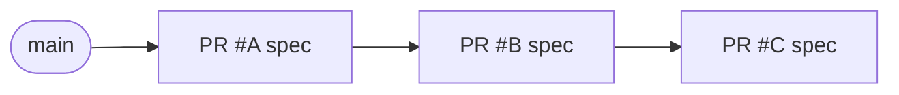

# merge-steward operator reference

Full setup, configuration, and troubleshooting reference for `merge-steward`. For the high-level pitch, see the [package README](../packages/merge-steward/README.md). For the two-service overview, see [merge-queue.md](./merge-queue.md). For design rationale, see [design-docs/merge-steward.md](./design-docs/merge-steward.md).

## Prerequisites

- Node.js 24+
- `gh` CLI in `PATH`
- `git` binary

## Install and bootstrap

```bash
npm install -g merge-steward
merge-steward init https://queue.example.com
```

`init` creates:

- `~/.config/merge-steward/runtime.env`
- `~/.config/merge-steward/service.env`
- `~/.config/merge-steward/merge-steward.json`
- `~/.config/merge-steward/repos/`
- `/etc/systemd/system/merge-steward.service`

## Attach a repository

```bash
merge-steward attach owner/repo
```

`attach` writes `~/.config/merge-steward/repos/<derived-id>.json`. The steward:

- derives the `repoId` from the GitHub repo name
- discovers the default branch from GitHub
- learns required checks from GitHub branch protection at runtime (no local copy)

Pass `--refresh` to re-discover the base branch for an existing repo config. `merge-steward doctor --repo <id>` reports the currently-enforced GitHub-required checks for the branch.

### Repo config fields

The file `attach` writes looks like:

```json
{
  "repoId": "app",
  "repoFullName": "owner/repo",
  "baseBranch": "main",
  "clonePath": "~/.local/state/merge-steward/repos/app",
  "maxRetries": 2,
  "flakyRetries": 1,
  "pollIntervalMs": 30000,
  "admissionLabel": "queue",
  "mergeQueueCheckName": "merge-steward/queue",
  "server": { "bind": "127.0.0.1", "port": 8790 },
  "database": { "path": "~/.local/state/merge-steward/app.sqlite" }
}
```

| Field | Description |
|-|-|
| `repoId` | Internal ID for this repo (used in DB keys) |
| `repoFullName` | GitHub `owner/repo` |
| `baseBranch` | Target branch for merges (usually `main`) |
| `clonePath` | Local clone directory (created on first run) |
| `maxRetries` | Rebase/CI retry attempts before eviction |
| `flakyRetries` | CI-only retries, separate from `maxRetries` |
| `pollIntervalMs` | Reconciliation loop interval |
| `admissionLabel` | Optional GitHub label used as a manual admission nudge |
| `mergeQueueCheckName` | Name of the check run emitted on eviction |

## GitHub App configuration

Required **repository permissions**:

| Permission | Access | Why |
|-|-|-|
| Contents | Read and write | Fast-forward `main` to tested speculative SHAs |
| Pull requests | Read and write | |
| Checks | Read and write | Emit eviction check runs |
| Metadata | Read-only | |
| Administration | Read-only | Discover branch rules and required checks without a user token |

`Administration: Read-only` is not required for merging itself — it lets the doctor and attach/refresh flows learn branch protection policy.

When GitHub App auth is configured, the steward mints short-lived installation tokens and uses them for both `gh` API calls and `git clone/fetch/push` over HTTPS. In multi-repo setups it resolves the installation per repo, so repos in different GitHub App installations coexist.

## Secrets

Keep only non-secret identifiers in `~/.config/merge-steward/service.env`:

```bash
MERGE_STEWARD_GITHUB_APP_ID=123456
MERGE_STEWARD_GITHUB_APP_INSTALLATION_ID=12345678
```

Store secrets in encrypted systemd credentials:

- `/etc/credstore.encrypted/merge-steward-webhook-secret.cred`
- `/etc/credstore.encrypted/merge-steward-github-app-pem.cred`

Webhook-secret resolution order at runtime:

1. `$CREDENTIALS_DIRECTORY/<name>`
2. `${ENV_KEY}_FILE`
3. `${ENV_KEY}`

See [secrets.md](./secrets.md) for the stack-wide convention.

## GitHub webhook

Configure one webhook per repository pointing to the steward:

- **Payload URL**: `https://queue.example.com/webhooks/github`
- **Content type**: `application/json`
- **Secret**: same as `MERGE_STEWARD_WEBHOOK_SECRET` or the encrypted credential
- **Events**: Pull requests, Pull request reviews, Check suites, Pushes, Branch protection rules, Repository rulesets

The steward uses a single multi-repo webhook endpoint and routes events by `repository.full_name`. It wakes on:

- PR label changes
- review approvals
- successful check-suite completion
- pushes to the base branch
- branch protection edits
- repository ruleset edits

On startup, the steward reconciles GitHub branch protection for every attached repo. Policy changes are normally learned from GitHub policy webhooks. If a merge is rejected unexpectedly, the steward performs a guarded one-shot policy refresh to recover from a missed webhook without polling GitHub continuously.

## CLI surface

| Command | Purpose |
|-|-|
| `merge-steward init <public-base-url>` | Bootstrap the local home |
| `merge-steward attach <owner/repo>` | Create or update a repo config, restart the service |
| `merge-steward repo list` / `repo show <id>` | Inspect attached repos |
| `merge-steward doctor --repo <id>` | Validate config, auth, branch rules, required checks |
| `merge-steward service status` / `restart` / `logs` | Service controls |
| `merge-steward dashboard [--repo <id>] [--pr <num>]` | Operator UI across all configured projects |
| `merge-steward queue status [--repo <id>]` | Queue summary and current entries |
| `merge-steward queue show --pr <num>` | One entry with events and incidents |
| `merge-steward queue reconcile --repo <id>` | Trigger one reconcile tick immediately |
| `merge-steward pr status [--wait --timeout S --poll S]` | Single-PR verdict with stable exit code |
| `merge-steward serve` | Manual foreground run (all attached repos) |

### Resolving `--repo` and `--pr` from the current checkout

`pr status`, `queue status`, `queue show`, and `queue reconcile` accept explicit flags but auto-resolve when run inside a git checkout. The steward reads `origin`'s remote URL, matches it to an attached `repoId`, and uses `gh pr view` to find the PR for the current branch. Pass `--cwd <path>` to resolve from a different directory.

### Exit codes for `pr status`

| Code | Meaning |
|-|-|
| 0 | merged / approved with green required checks |
| 2 | changes_requested / failing required checks / evicted / closed |
| 3 | still in flight (queued, preparing, validating, merging, pending) |
| 4 | `--wait` timed out before a terminal state |
| 1 | usage or configuration error |

## How the queue actually works

The steward runs a reconcile loop per repo. Each tick asks: "for each queue entry, what state transition is currently possible?" The following sections show the real git commands executed at each step. Implementation in `packages/merge-steward/src/github/shell-git.ts` and `packages/merge-steward/src/reconciler-*.ts`.

### Speculative chain

The queue is serial, but validation is parallel: each entry is tested on a **cumulative speculative branch** that stacks every entry ahead of it in the queue.



The head entry's spec is `main + A`. The second entry's spec is `main + A + B`, built on top of A's spec. The third is `main + A + B + C`. When A lands, B's spec is already the tested tree — no re-validation needed. When A fails and gets evicted, B and C rebuild without it (**cascade invalidation**).

### Step 1 — build the speculative branch

When an entry becomes the head and `main` is healthy (required checks green, no retry gate), the steward builds its speculative branch in an **isolated worktree** so it never touches the main clone's working tree.

```bash
# 1. Refresh remote refs
git fetch

# 2. Clean up any leftover from a previous attempt
git worktree remove --force <wt-path>
git branch -D mq-spec-<entry-id>
git worktree prune

# 3. Create an isolated worktree at the base (main, or the previous entry's spec)
git worktree add -B mq-spec-<entry-id> <wt-path> <base>

# 4. Use the steward's bot identity for the merge commit
git -C <wt-path> config user.name  <bot-name>
git -C <wt-path> config user.email <bot-email>

# 5. Merge the PR branch into the spec (non-fast-forward; patience strategy)
git -C <wt-path> merge --no-ff -X patience -m "Merge PR #<num>: <branch>" origin/<pr-branch>

# 6. Record the spec SHA for later verification
git -C <wt-path> rev-parse HEAD   # → this is the SHA CI will run against

# 7. Remove the worktree but keep the branch ref
git worktree remove --force <wt-path>
```

If the `merge` step hits a conflict, the steward first tries to auto-resolve lockfile-only conflicts by regenerating them (`tryAutoResolveConflict`). Otherwise it aborts the merge, destroys the spec branch, and either retries (on base-SHA change) or evicts the entry with an `integration_conflict` incident.

### Step 2 — push the spec and wait for CI

```bash
# Push the spec branch to GitHub so CI and reviewers can see it
git push --force-with-lease origin mq-spec-<entry-id>
```

The steward then triggers a CI run on that SHA (or lets GitHub's push-triggered workflows fire) and transitions the entry to `validating`. Status updates come from webhook events (`check_suite completed`) rather than polling.

### Step 3 — revalidate and fast-forward main

When CI is green, the steward revalidates before merging:

1. GitHub PR is not already `merged` externally.
2. The reviewer approval on the original PR head still holds.
3. The spec SHA is still a fast-forward from current `main` (`git merge-base --is-ancestor`).
4. `main`'s own required checks are still passing.

If all four hold, the merge is a single command:

```bash
# Fast-forward main to the already-tested spec SHA
git push origin mq-spec-<entry-id>:main
```

That is the actual "merge" — **no `gh pr merge` button is ever pressed**. What lands on `main` is byte-for-byte the tree that CI validated. This is why the steward needs `Contents: Read and write` on the GitHub App and must be allowed to push to protected branches.

If the push is rejected (main advanced, policy changed), the steward either refreshes its cached policy + retries, or increments the retry counter. Push failures that exhaust the retry budget evict the entry.

### Step 4 — post-merge cleanup

```bash
# Delete the spec branch
git push origin --delete mq-spec-<entry-id>

# Delete the PR's head branch (the PR is already merged, branch is cosmetic)
# Done via GitHub API, not shell git
```

A post-merge verification pass records the state of `main`'s CI on the new tip; if it goes red, the next entry's `preparing_head` will see `main_broken` and wait.

### Cascade invalidation

If the head entry fails mid-queue (spec CI red, push rejected, merge conflict), the steward invalidates every downstream spec that depended on it and rebuilds them without the evicted entry. Each downstream entry transitions back to `preparing_head` and runs Step 1 again against the new base.

### State machine (simplified)

```
queued → preparing_head → validating → merging → merged
                                              → evicted (on failure after retries)
```

| State | Meaning |
|-|-|
| `queued` | Waiting in line |
| `preparing_head` | Fetching and building the speculative branch |
| `validating` | CI running on the speculative SHA |
| `merging` | Revalidation + fast-forward landing |
| `merged` | Done |
| `evicted` | Failed after retry budget; incident created |
| `dequeued` | Manually removed |

## Merge gate

The real gate is:

- GitHub says the PR review state is approved
- configured required checks are green
- the steward's speculative integrated branch passes CI

`review-quill/verdict` only matters if you choose to include it in the repo's required checks.

GitHub branch protection is still useful as defense in depth, but the steward does not merge by pressing GitHub's merge button — it fast-forwards `main` to the already-tested speculative SHA. Successful queue merges therefore depend on the steward App being allowed to push that result to the protected branch.

## HTTP API

| Endpoint | Method | Description |
|-|-|-|
| `/health` | GET | Liveness check |
| `/repos/:repoId/queue/status` | GET | All queue entries for one repo |
| `/repos/:repoId/queue/watch` | GET | Snapshot used by the dashboard |
| `/repos/:repoId/queue/enqueue` | POST | Manually enqueue a PR |
| `/repos/:repoId/queue/reconcile` | POST | Trigger one reconcile tick |
| `/repos/:repoId/queue/entries/:id/detail` | GET | Entry detail with recent events and incidents |
| `/repos/:repoId/queue/entries/:id/dequeue` | POST | Remove from queue (non-destructive) |
| `/repos/:repoId/queue/entries/:id/update-head` | POST | Update head SHA (force-push) |
| `/repos/:repoId/queue/incidents/:id` | GET | Get incident details |
| `/repos/:repoId/queue/entries/:id/incidents` | GET | List incidents for an entry |
| `/webhooks/github` | POST | GitHub webhook receiver for all configured repos |

## Dashboard

`merge-steward dashboard` is the primary operator surface. The overview screen shows all configured projects with project-level queue health, readable stats, and a compact queue chain. Press `Enter` on a project for the detail view (queue entries, recent events, incidents for evicted PRs, live GitHub-required checks).

Controls: `j`/`k` or arrows move selection; `Enter` opens; `Esc` returns; `a` toggles active-vs-all in project view; `r` reconciles; `d` dequeues; `q` quits.

Use `--repo <id>` to open the project detail view directly, `--pr <num>` to preselect a PR.

## Interaction with PatchRelay

The steward and PatchRelay are independent services that communicate only through GitHub:

1. PatchRelay reaches `awaiting_queue` when the linked PR is approved and green, and may add the configured queue label as an admission nudge.
2. The steward admits from fresh GitHub truth, then either lands the PR or evicts it and creates the configured eviction check run (default `merge-steward/queue`).
3. PatchRelay watches for that check run failure and triggers `queue_repair`.
4. After repair, PatchRelay pushes a new head.
5. The steward re-admits the PR after the new head is approved and green.

Neither service calls the other's API. See [merge-queue.md](./merge-queue.md) for the contract.

## systemd

```ini
[Unit]
Description=merge-steward
After=network-online.target
Wants=network-online.target

[Service]
Type=simple
EnvironmentFile=-/home/your-user/.config/merge-steward/runtime.env
EnvironmentFile=-/home/your-user/.config/merge-steward/service.env
LoadCredentialEncrypted=merge-steward-webhook-secret:/etc/credstore.encrypted/merge-steward-webhook-secret.cred
LoadCredentialEncrypted=merge-steward-github-app-pem:/etc/credstore.encrypted/merge-steward-github-app-pem.cred
ExecStart=/usr/bin/env merge-steward serve
Restart=on-failure
RestartSec=5s

[Install]
WantedBy=multi-user.target
```

## Troubleshooting

The gateway binds its HTTP port before repo initialization finishes. Each repo initializes independently in the background, so a bad clone or GitHub discovery problem stays local to that repo instead of taking down the whole dashboard.

| Symptom | First command |
|-|-|
| Is the service alive? | `merge-steward service status` |
| What is the queue doing right now? | `merge-steward dashboard` (or `queue status --repo <id>` in a shell) |
| Why is this PR stuck? | `merge-steward pr status` inside its checkout, then `queue show --pr <num>` |
| Eviction happened — why? | `merge-steward queue show --pr <num>` (events + incidents) |
| Queue looks frozen, no webhook activity | `merge-steward service logs --lines 100` |
| Required checks not enforced as expected | `merge-steward doctor --repo <id>` reports current GitHub policy |

## Current scope

Implemented:

- Speculative execution: cumulative branches (`main+A`, `main+A+B`, `main+A+B+C`) tested in parallel. Configurable depth (default 10, set `speculativeDepth: 1` for serial mode).
- Speculative consistency: when the head lands, downstream entries that already passed do not re-test if their assumptions still hold.
- Cascade invalidation: when a mid-chain entry fails, downstream speculative branches are rebuilt without it.
- Non-spinning conflict retry gated on base SHA change.
- Flaky CI retry budget (separate from retry budget).
- Revalidation before landing (approval, SHA, external merge).
- Durable incident records on eviction.
- GitHub check run as eviction signal.
- Admission and re-admission from fresh GitHub truth, with queue labels as optional nudges and controls.
- Structured reconciler event stream for observability.

Not built yet (see [design doc](./design-docs/merge-steward.md)):

- Binary bisection on batch failure.
- File-path conflict detection for parallel lanes.
- Flaky test learning (only retry budget today, no historical analysis).
