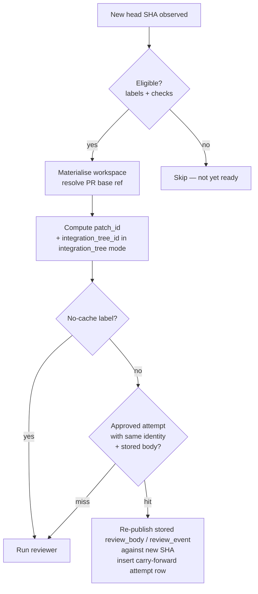

# review-quill operator reference

Full setup, configuration, and troubleshooting reference for `review-quill`: the review gate that pairs with coding agents by checking both the narrow diff and wider system context for misalignments, sending fixes back through ordinary GitHub reviews, and carrying approval forward only when the patch identity is unchanged. For the high-level pitch, see the [package README](../packages/review-quill/README.md). For the background story, see [review-quill: a strict reviewer for your coding agent](https://blog.krasnoperov.me/posts/review-quill); for the broader gate framing, see [The gates, not the autonomy](https://blog.krasnoperov.me/posts/gates-not-autonomy). For design rationale, see [design-docs/review-quill.md](./design-docs/review-quill.md).

## Install and bootstrap

```bash
pnpm add -g review-quill
review-quill init https://patchrelay.example.com/review
```

`init` creates:

- `~/.config/review-quill/runtime.env`
- `~/.config/review-quill/service.env`
- `~/.config/review-quill/review-quill.json`
- `/etc/systemd/system/review-quill.service`

## GitHub App configuration

Required **repository permissions**:

| Permission | Access | Why |
|-|-|-|
| Contents | Read-only | Materialize managed checkouts at the reviewed head SHA |
| Pull requests | Read and write | Submit `APPROVE` / `REQUEST_CHANGES` reviews |
| Checks | Read and write | Create and update `review-quill/verdict` check runs |
| Actions | Read-only | Observe CI state |
| Metadata | Read-only | |

Required **webhook events**: `Pull request`, `Check run`, `Check suite`.

Recommended secret storage — encrypted systemd credentials:

- `review-quill-webhook-secret`
- `review-quill-github-app-pem`

Plus the non-secret identifiers in `service.env`:

```bash
REVIEW_QUILL_GITHUB_APP_ID=123456
REVIEW_QUILL_GITHUB_APP_INSTALLATION_ID=12345678
```

First-time local bring-up may use environment-file secrets; production should prefer encrypted systemd credentials. See [secrets.md](./secrets.md) for the stack-wide convention.

## Public ingress

Recommended public base URL: `https://patchrelay.example.com/review`.

Public endpoints:

- `POST /review/webhooks/github` — GitHub App webhook
- `GET /review/health` — external health check
- `GET /review/attempts/:id` — check-run detail links

Keep local-only: `/review/watch`, `/review/attempts`, `/review/admin/*`.

The package ships an example Caddy config at [infra/Caddyfile](../packages/review-quill/infra/Caddyfile).

## Attach a repository

```bash
review-quill repo attach owner/repo
```

`repo attach` is idempotent. It:

- adds or updates one watched repository
- auto-discovers the default branch and required checks when possible
- stores repo-local review doc paths
- starts reviews immediately after branch updates by default; pass `--wait-for-green-checks` to gate on configured checks first
- reloads the service when needed

If you want machine review to count toward merge admission, include `review-quill/verdict` in the repository's required checks and in any downstream merge queue policy.

## CLI surface

| Command | Purpose |
|-|-|
| `review-quill init <public-base-url>` | Bootstrap the local home |
| `review-quill repo attach <owner/repo>` | Create or update a watched repo |
| `review-quill repo list` | List watched repos |
| `review-quill repo show <id>` | Show one repo config |
| `review-quill doctor --repo <id>` | Validate config, secrets, binaries, service reachability |
| `review-quill service status` | systemd state + local health |
| `review-quill service restart` | Reload the service |
| `review-quill service logs --lines 100` | Recent journal output |
| `review-quill dashboard` | Live operator UI |
| `review-quill attempts [<repo>] [<pr>]` | Recorded review attempts for one PR |
| `review-quill transcript [<repo>] [<pr>]` | Visible Codex thread for a review attempt |
| `review-quill transcript-source [<repo>] [<pr>]` | Raw Codex session file |
| `review-quill pr status [--wait --timeout S --poll S]` | Single-PR verdict with stable exit code |
| `review-quill diff --repo <id>` | Debug: the exact local diff the reviewer would see |

### Resolving `--repo` and `--pr` from the current checkout

`pr status`, `attempts`, `transcript`, and `transcript-source` accept explicit flags but auto-resolve when run inside a git checkout. `review-quill` reads `origin`'s remote URL, matches it to an attached `repoId`, and uses `gh pr view` to find the PR for the current branch. Pass `--cwd <path>` to resolve from a different directory.

### Exit codes for `pr status`

| Code | Meaning |
|-|-|
| 0 | approved / skipped |
| 2 | declined (changes requested) / errored / cancelled |
| 3 | queued / running / no attempt yet |
| 4 | `--wait` timed out before a terminal state |
| 1 | usage or configuration error |

## Review context pipeline

`review-quill` reviews from a real checked-out PR head, not just GitHub API metadata.

Default context path for each reviewable PR:

1. Ephemeral local checkout at the exact PR head SHA (or, in `integration_tree` mode, a synthetic merge commit — see [Review surface modes](#review-surface-modes) below).
2. Local `git diff <base>...HEAD` inventory and curated patch set.
3. Repo guidance: configured review docs plus universal `AGENTS.md` (`REVIEW_WORKFLOW.md`, `AGENTS.md` by default), plus local Markdown docs explicitly referenced by the PR title/body.
4. Prior formal PR reviews from GitHub.
5. Optional Linear issue context when issue keys appear in the PR metadata.

The built-in review scaffold lives in `packages/review-quill/src/prompt-builder/render.ts`. The always-on reviewer prompt stays small: output contract, review rules, PR metadata, diff, repo guidance, prior review claims. Install-level and repo-level prompt config can add one extra instructions file or replace the review-rubric section — see [prompting.md](./prompting.md).

Diff context is intentionally filtered:

- noisy/generated paths can be ignored or summarized
- oversized patches are summarized instead of dumped whole
- repo config tunes ignore/summarize patterns and patch budgets

Review execution concurrency defaults to 4. The cap is configurable with `reconciliation.maxConcurrentReviews`; keep it conservative on hosts where many reviews share one Codex app-server and the same per-repo git cache.

Review threads start fresh by default. `codex.forkPriorReviewThread: true` enables a conservative optimization for a newer head: Review Quill may fork only the immediately preceding decisive attempt when its live Codex thread ends at the recorded completed turn and its review surface, base SHA, and prompt fingerprint still match. A successful fork receives a bounded follow-up prompt with the current inventory and inspects the current checkout instead of receiving patch bodies again. Fresh starts and Codex's explicit missing-rollout fallback keep the full prompt; other protocol, authentication, model, sandbox, transport, or timeout failures remain visible as errors. Set the option back to `false` to roll back immediately to always-fresh review threads.

Codex remains the source of truth for the full review transcript. SQLite stores thread/turn identifiers, verdicts, bounded summaries, timings, and publication outcomes; it does not store a second transcript. The transcript command reads Codex live. Processed webhook delivery records are pruned after seven days.

## Carry-forward

review-quill caches approved verdicts so a head SHA change that does not change the patch (rebase onto fresh main, force-push of the same content, etc.) does not trigger a fresh review run. The cache key is the change identity computed by the algorithms in [github-queue-contract.md](./github-queue-contract.md#identity-algorithms).



Three properties worth knowing:

- **PR-base-ref aware.** Materialisation reads the PR's GitHub-reported base ref, not the repo default. For a stacked PR (`B.base = A.branch`), the diff base — and so `patch_id` — is computed against the parent PR's head, not main.
- **Stored, not fetched.** The rendered `review_body` and `review_event` (`APPROVE` / `REQUEST_CHANGES` / `COMMENT`) are stored on each `review_attempts` row so carry-forward can re-publish without a GitHub round-trip.
- **Rollout-safe.** Old rows from before the carry-forward migration have NULL `review_body` and naturally fall through to a fresh review. No data migration needed; the cache hit rate climbs over time as new rows accumulate.

A PR carrying the configured no-cache label (default `review:no-cache`) is always re-reviewed even when the patch is unchanged.

## Review surface modes

`reviewSurfaceMode` (per-repo config) selects what surface the reviewer reads. The cache key shape is coupled to the mode — see [github-queue-contract.md](./github-queue-contract.md#review-carry-forward) for the full contract.

| Mode | What the reviewer reads | Cache key | Trade-off |
|-|-|-|-|
| `head` (default) | The PR head's diff against its base | `patch_id` only | Trivial rebases carry forward; semantic merge issues are caught at integration time by the lander's spec CI |
| `integration_tree` | A synthetic merge commit (`git commit-tree tree -p base -p head`) checked out as the worktree | `(patch_id, integration_tree_id)` | Most base-advance rebases re-review (the integrated tree changes when main moves); semantic merge issues are caught at *review* time |

In `integration_tree` mode, when `git merge-tree --write-tree` reports a real conflict, the attempt is marked declined with reason `cannot_integrate` rather than throwing. Publication is body-only (the inline-comments path is incompatible with publishing against a synthetic SHA the PR head doesn't know about); findings are embedded in the review body as file:line references.

## Operator-visible bus

review-quill subscribes to and writes the following GitHub artifacts. Names are configurable per repo; defaults shown.

| Artifact | Direction | Default name |
|-|-|-|
| `merge-steward/spec-ready` | Read (in `integration_tree` mode) — the lander signals "spec for this PR is at SHA X" | `merge-steward/spec-ready` |
| No-cache PR label | Read | `review:no-cache` |
| GitHub PR review (`APPROVE` / `REQUEST_CHANGES` / `COMMENT`) | Write | — |
| `review-quill/verdict` check_run | Write | `review-quill/verdict` |

## Troubleshooting

Start with `review-quill doctor --repo <id>`. After that:

| Symptom | First command |
|-|-|
| Is the service alive? | `review-quill service status` |
| What reviews are queued/running/completed? | `review-quill dashboard` |
| Is this one PR approved or declined? | `review-quill pr status` (inside the PR's checkout) |
| Why did the reviewer decline? | `review-quill transcript --pr <num>` |
| Review state looks stuck — what is the reviewer seeing? | `review-quill diff --repo <id>` |
| GitHub is not counting reviews toward branch protection | Confirm App permissions above, confirm repo requires the expected review/check signals, re-run `doctor` |
| Webhooks not arriving, Codex failing, or GitHub publishing failing | `review-quill service logs --lines 100` |

## systemd

The `init` command writes a unit that loads secrets from systemd encrypted credentials and starts `review-quill serve`. See the generated `/etc/systemd/system/review-quill.service` for the canonical shape.
