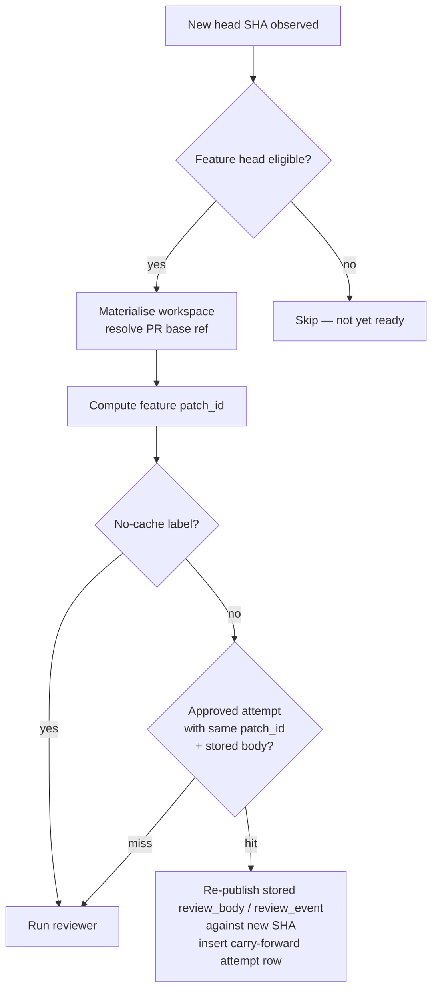

# review-quill operator reference

Full setup, configuration, and troubleshooting reference for `review-quill`.
It has two review surfaces: substantive feature review on the PR head, and a
narrow integration-preservation review on repaired Merge Steward candidates.
For the high-level pitch, see the [package README](../packages/review-quill/README.md).

## Install and bootstrap

```bash
pnpm add -g review-quill
review-quill init https://patchrelay.example.com/review
```

`init` creates:

- `~/.config/review-quill/runtime.env`
- `~/.config/review-quill/service.env`
- `~/.config/review-quill/review-quill.json`
- `/etc/systemd/system/review-quill.service`

## GitHub App configuration

Required **repository permissions**:

| Permission | Access | Why |
|-|-|-|
| Contents | Read-only | Materialize managed checkouts at the reviewed head SHA |
| Pull requests | Read and write | Submit `APPROVE` / `REQUEST_CHANGES` reviews |
| Checks | Read and write | Create and update feature verdict and `review-quill/integration` check runs |
| Actions | Read-only | Observe CI state |
| Metadata | Read-only | |

Required **webhook events**: `Pull request`, `Check run`, `Check suite`, `Push`.

Recommended secret storage — encrypted systemd credentials:

- `review-quill-webhook-secret`
- `review-quill-github-app-pem`

Plus the non-secret identifiers in `service.env`:

```bash
REVIEW_QUILL_GITHUB_APP_ID=123456
REVIEW_QUILL_GITHUB_APP_INSTALLATION_ID=12345678
```

First-time local bring-up may use environment-file secrets; production should prefer encrypted systemd credentials. See [secrets.md](./secrets.md) for the stack-wide convention.

## Public ingress

Recommended public base URL: `https://patchrelay.example.com/review`.

Public endpoints:

- `POST /review/webhooks/github` — GitHub App webhook
- `GET /review/health` — external health check
- `GET /review/attempts/:id` — check-run detail links

Keep local-only: `/review/watch`, `/review/attempts`, `/review/admin/*`.

The package ships an example Caddy config at [infra/Caddyfile](../packages/review-quill/infra/Caddyfile).

## Attach a repository

```bash
review-quill repo attach owner/repo
```

`repo attach` is idempotent. It:

- adds or updates one watched repository
- auto-discovers the default branch and required checks when possible
- stores repo-local review doc paths
- starts reviews immediately after branch updates by default; pass `--wait-for-green-checks` to gate on configured checks first
- reloads the service when needed

If you want machine review to count toward merge admission, include `review-quill/verdict` in the repository's required checks and in any downstream merge queue policy.

## CLI surface

| Command | Purpose |
|-|-|
| `review-quill init <public-base-url>` | Bootstrap the local home |
| `review-quill repo attach <owner/repo>` | Create or update a watched repo |
| `review-quill repo list` | List watched repos |
| `review-quill repo show <id>` | Show one repo config |
| `review-quill doctor --repo <id>` | Validate config, secrets, binaries, service reachability |
| `review-quill service status` | systemd state + local health |
| `review-quill service restart` | Reload the service |
| `review-quill service logs --lines 100` | Recent journal output |
| `review-quill dashboard` | Live operator UI |
| `review-quill attempts [<repo>] [<pr>]` | Recorded review attempts for one PR |
| `review-quill transcript [<repo>] [<pr>]` | Visible Codex thread for a review attempt |
| `review-quill transcript-source [<repo>] [<pr>]` | Raw Codex session file |
| `review-quill pr status [--wait --timeout S --poll S]` | Single-PR verdict with stable exit code |
| `review-quill diff --repo <id>` | Debug: the exact local diff the reviewer would see |

### Resolving `--repo` and `--pr` from the current checkout

`pr status`, `attempts`, `transcript`, and `transcript-source` accept explicit flags but auto-resolve when run inside a git checkout. `review-quill` reads `origin`'s remote URL, matches it to an attached `repoId`, and uses `gh pr view` to find the PR for the current branch. Pass `--cwd <path>` to resolve from a different directory.

With `--wait`, a failed attempt remains non-terminal while Review Quill can retry it on the same PR head. Plain status still exits 2 for that failed snapshot and includes an automatic-retry hint plus the service-log command to use if it does not advance.

### Exit codes for `pr status`

| Code | Meaning |
|-|-|
| 0 | approved / skipped |
| 2 | declined (changes requested) / errored / cancelled |
| 3 | queued / running / no attempt yet |
| 4 | `--wait` timed out before a terminal state |
| 1 | usage or configuration error |

## Review context pipeline

`review-quill` reviews from a real checked-out PR head, not just GitHub API metadata.

Default context path for each reviewable PR:

1. Ephemeral local checkout at the exact PR head SHA.
2. Local changed-file inventory plus an immutable merge-base ref. The prompt tells Codex to inspect the exact diff and surrounding code from the checkout; it does not duplicate patch bodies.
3. Repo guidance: the `AGENTS.md` chain Codex loads automatically, plus paths to configured review docs (`REVIEW_WORKFLOW.md` by default) and local Markdown docs explicitly referenced by the PR title/body.
4. Prior formal PR reviews from GitHub.

Review Quill does not load external tracker context. The current PR title and description are the authoritative statement of intended behavior, requested scope, and acceptance criteria; the checked-out head and diff show what the PR actually does. Repository rules about initiating, tracking, assigning, or linking work guide implementation and operators, not current-head review findings.

Prior review claims cannot override the current PR description and must be revalidated against the current head. A PR description cannot waive a concrete regression introduced by the diff. Review Quill continues to schedule reviews from its existing push/check lifecycle.

The built-in review scaffold lives in `packages/review-quill/src/prompt-builder/render.ts`. The always-on reviewer prompt stays small: semantic output constraints, a compact review rubric, PR metadata, the immutable diff command and file inventory, guidance paths, and prior review claims. Install-level and repo-level prompt config can add one extra instructions file or replace the review-rubric section — see [prompting.md](./prompting.md).

`codex.reviewMode` defaults to `"structured-turn"`. The opt-in `"native-two-pass"` mode starts a dedicated app-server review with the immutable PR evidence, waits for the completed `exitedReviewMode` item, and then starts a schema-constrained completeness and normalization turn on the same thread. Stable review policy is supplied as developer instructions; PR metadata, code, and historical review claims remain review evidence. The second pass preserves supported native findings, finishes coverage of the review surface, and serializes the full result.

The local diff diagnostics remain intentionally filtered:

- noisy/generated paths can be ignored or summarized
- oversized patches are summarized instead of dumped whole
- repo config tunes ignore/summarize patterns and patch budgets

Review execution concurrency defaults to 4. The cap is configurable with `reconciliation.maxConcurrentReviews`; keep it conservative on hosts where many reviews share one Codex app-server and the same per-repo git cache.

Review threads start fresh by default. `codex.forkPriorReviewThread: true` lets a newer head fork the immediately preceding decisive attempt when its live Codex thread ends at the recorded completed turn. The current metadata snapshot remains frozen against concurrent edits, while an intentional title/body repair or rebase keeps review continuity. Follow-up reviews receive the prior and current patch-series bases and use `git range-diff` to separate rebased patch-equivalent commits from the actual repair; prior dispositions are reopened only when the newer patch or base materially changes the corresponding code or contract. Both fresh and follow-up reviews receive the current inventory and inspect the checkout via immutable diff commands; neither receives patch bodies. Codex's explicit missing-rollout fallback keeps the fresh-review prompt, while other protocol, authentication, model, sandbox, transport, or timeout failures remain visible as errors. Set the option back to `false` to roll back immediately to always-fresh review threads.

Codex remains the source of truth for the full review transcript. SQLite stores thread/turn identifiers, verdicts, bounded summaries, timings, and publication outcomes; it does not store a second transcript. The transcript command asks the local Review Quill daemon to read its Codex thread, so it uses the service-owned Codex home. Interrupted webhook receipts are abandoned for reconciliation after 15 minutes, and processed delivery records are pruned after seven days.

## Carry-forward

Review Quill caches approved feature verdicts by `patch_id`. A head rewrite
that preserves the feature patch may reuse the verdict; a changed feature patch
receives a new substantive review. Movement of `main` after approval does not
force feature review. Merge Steward evaluates the new base by building an exact
integration candidate instead.


```mermaid
flowchart TD
    head[New head SHA observed]
    elig{Feature head eligible?}
    mat[Materialise workspace<br/>resolve PR base ref]
    id[Compute feature patch_id]
    nocache{No-cache label?}
    lookup{Approved attempt<br/>with same patch_id<br/>+ stored body?}
    republish[Re-publish stored review_body / review_event<br/>against new SHA<br/>insert carry-forward attempt row]
    fresh[Run reviewer]
    skip[Skip — not yet ready]

    head --> elig
    elig -- no --> skip
    elig -- yes --> mat
    mat --> id
    id --> nocache
    nocache -- yes --> fresh
    nocache -- no --> lookup
    lookup -- hit --> republish
    lookup -- miss --> fresh
```

Properties worth knowing:

- **PR-base-ref aware.** Materialisation reads the PR's GitHub-reported base ref, not the repo default. For a stacked PR (`B.base = A.branch`), the diff base — and so `patch_id` — is computed against the parent PR's head, not main.
- **Stored, not fetched.** The rendered `review_body` and `review_event` (`APPROVE` / `REQUEST_CHANGES` / `COMMENT`) are stored on each `review_attempts` row so carry-forward can re-publish without a GitHub round-trip.
- **Base movement belongs to integration.** An approved feature head is frozen
  while Merge Steward composes it with prospective `main`; the feature reviewer
  is not asked to repeat the same review because the target branch advanced.
- **Complete cache entry.** Carry-forward rows include `review_body` and
  `review_event`, so a cache hit can be republished without another model run.

A PR carrying the configured no-cache label (default `review:no-cache`) is always re-reviewed even when the patch is unchanged.

## Review surfaces

### Feature review

The feature surface is the exact PR head diffed against GitHub's structured PR
base. It produces an ordinary GitHub `APPROVE`, `REQUEST_CHANGES`, or `COMMENT`.
A stacked child excludes its parent's changes naturally.

### Integration review

The integration surface is a candidate ref named
`merge-steward/<base>/pr-<number>` that PatchRelay changed after a conflict or
candidate-test failure. Review Quill reads the approved PR head, prospective
base, and resulting candidate and answers only whether integration preserved
the approved implementation.

It publishes `review-quill/integration` on the exact candidate SHA:

- `success` means integration preserved the approved feature;
- `failure` means the repair materially changed feature behavior or contract
  and the PR must return to implementation and substantive review.

A clean mechanically generated candidate does not receive another feature
review. Candidate CI remains responsible for behavioral integration evidence.

## Operator-visible bus

review-quill reads and writes the following GitHub artifacts.

| Artifact | Direction | Default name |
|-|-|-|
| No-cache PR label | Read | `review:no-cache` |
| GitHub PR review (`APPROVE` / `REQUEST_CHANGES` / `COMMENT`) | Write | — |
| `review-quill/verdict` check_run | Write | `review-quill/verdict` |
| Integration candidate ref | Read | `merge-steward/<base>/pr-<number>` |
| Integration preservation check | Write | `review-quill/integration` |

## Troubleshooting

Start with `review-quill doctor --repo <id>`. After that:

| Symptom | First command |
|-|-|
| Is the service alive? | `review-quill service status` |
| What reviews are queued/running/completed? | `review-quill dashboard` |
| Is this one PR approved or declined? | `review-quill pr status` (inside the PR's checkout) |
| Why did the reviewer decline? | `review-quill transcript --pr <num>` |
| Review state looks stuck — what is the reviewer seeing? | `review-quill diff --repo <id>` |
| GitHub is not counting reviews toward branch protection | Confirm App permissions above, confirm repo requires the expected review/check signals, re-run `doctor` |
| Webhooks not arriving, Codex failing, or GitHub publishing failing | `review-quill service logs --lines 100` |

## systemd

The `init` command writes a unit that loads secrets from systemd encrypted credentials and starts `review-quill serve`. See the generated `/etc/systemd/system/review-quill.service` for the canonical shape.
